# 计算机组成复习笔记

## 典型综合题

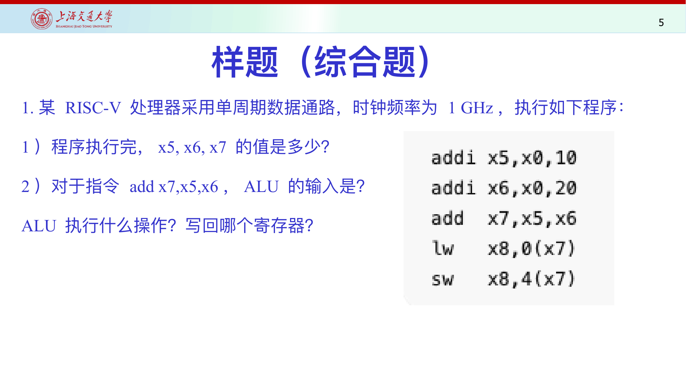

程序：

addi x5,x0,10 addi x6,x0,20 add x7,x5,x6 lw x8,0(x7) sw x8,4(x7)

结论：

- `x5 = 10`，`x6 = 20`，`x7 = 30`。

- 若只问 `add x7,x5,x6`：ALU 输入是 `x5` 和 `x6` 的读出值，即 `10` 和 `20`；ALU 操作是加法；结果写回 `x7`。

- 单周期 CPU 中每条指令 1 个周期。若时钟频率为 `1 GHz`，周期为 `1 ns`，这 5 条指令理想执行时间为 `5 ns`。

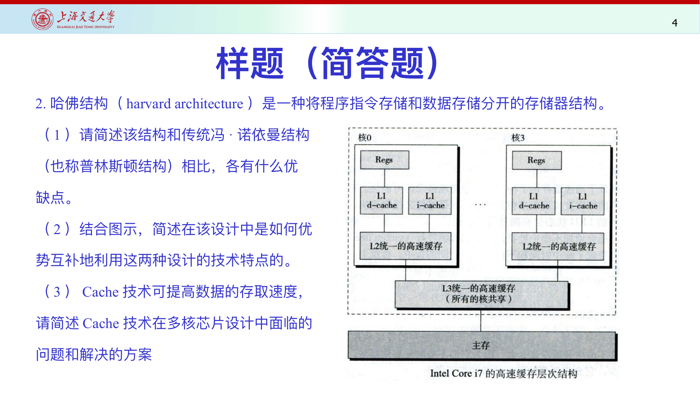

简答题模板：

- 哈佛结构：指令存储器和数据存储器分开，取指和访存可并行，结构清晰，带宽高；缺点是资源分开后灵活性差，容量难共享，软硬件设计更复杂。

- 冯诺依曼结构：指令和数据共用存储器，统一地址空间，简单灵活；缺点是取指和数据访问争用同一通路，形成冯诺依曼瓶颈。

- 现代处理器常用“改进哈佛结构”：L1 I-Cache 和 D-Cache 分开，降低取指/访存冲突；更下层 Cache 或主存统一，兼顾灵活性和性能。

- 多核 Cache 的问题：多个核可能缓存同一内存块，写入后副本不一致。解决：监听式无效化协议、更新协议、目录协议、MESI/MOESI 状态、内存屏障和一致性模型。

# 1. 计算机抽象与技术

本章要会把“快不快”说清楚：性能公式、影响因素、功耗墙和抽象层次是核心。

## 1.1 抽象层次和 ISA

计算机系统从上到下可以看成多层抽象：

- 应用程序

- 高级语言

- 汇编语言

- 指令集体系结构 ISA

- 微体系结构：数据通路、控制器、流水线、Cache

- 数字逻辑

- 器件和半导体工艺

ISA 是硬件/软件接口。软件只要遵守 ISA，就不必关心底层到底是单周期、多周期、流水线还是乱序执行。硬件只要实现同一个 ISA，就能运行同一类二进制程序。

## 1.2 性能公式

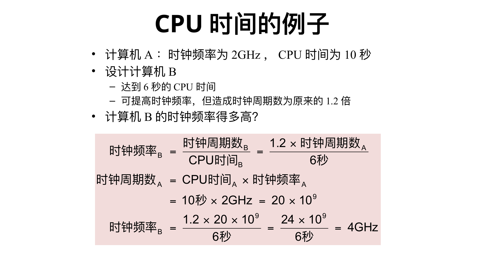

最核心公式：

``` math
CPU\ Time = Instruction\ Count \times CPI \times Clock\ Cycle\ Time
```

也可以写成：

``` math
CPU\ Time = \frac{Instruction\ Count \times CPI}{Clock\ Rate}
```

含义：

- 指令数 IC 受算法、编程语言、编译器、ISA 影响。

- CPI 受程序指令组合、微体系结构、Cache、流水线冒险影响。

- 时钟周期受工艺、数据通路关键路径、设计复杂度影响。

常见陷阱：

- 只看时钟频率不等于性能好。频率高但 CPI 大，可能更慢。

- 只看指令数不等于性能好。复杂指令可能条数少但周期长。

- MIPS 不适合跨 ISA 比较，因为不同 ISA 的指令工作量不同。

## 1.3 响应时间、吞吐率和加速比

- 响应时间：一个任务从开始到完成的时间。单个程序性能主要看它。

- 吞吐率：单位时间完成多少任务。服务器、批处理系统常看它。

- 相对性能：

``` math
Performance = \frac{1}{Execution\ Time}
```

若 A 比 B 快：

``` math
\frac{Performance_A}{Performance_B} = \frac{Execution\ Time_B}{Execution\ Time_A}
```

## 1.4 功耗墙

动态功耗近似：

``` math
Power \propto Capacitive\ Load \times Voltage^2 \times Frequency
```

降低电压能显著降功耗，但电压不能无限降；频率也不能无限升。因此现代性能提升更多依赖并行、流水线、Cache、向量化和专用加速器。

# 2. 指令：计算机的语言

本章核心是 RISC-V 的“规整性”：寄存器操作、load/store 架构、固定长度编码、少量格式组合出所有指令。

## 2.1 RISC-V 基本原则

核心设计原则：

- 简单源于规整：例如大多数指令是 32 位定长。

- 越小越快：寄存器数量有限，寄存器访问比内存快。

- 加速大概率事件：常用路径要快。

- 好设计需要折中：编码空间、硬件复杂度、程序长度之间要平衡。

RISC-V 是 load/store 架构：

- 算术逻辑运算只在寄存器之间做。

- 内存数据必须先用 `lw` 等 load 指令读入寄存器。

- 结果写回内存必须用 `sw` 等 store 指令。

## 2.2 寄存器和调用约定

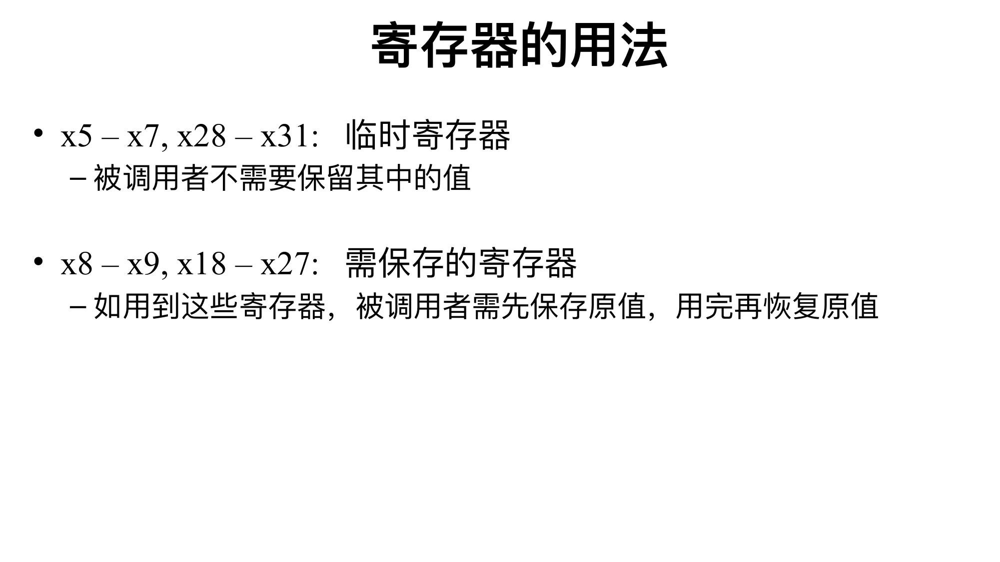

常用寄存器：

| 寄存器             | ABI 名   | 用途         | 保存责任       |
|:-------------------|:---------|:-------------|:---------------|
| `x0`               | `zero`   | 恒为 0       | 不可改         |
| `x1`               | `ra`     | 返回地址     | 调用者按需保存 |
| `x2`               | `sp`     | 栈指针       | 被调用者维护   |
| `x5-x7`, `x28-x31` | `t0-t6`  | 临时寄存器   | 调用者保存     |
| `x8-x9`, `x18-x27` | `s0-s11` | 保存寄存器   | 被调用者保存   |
| `x10-x17`          | `a0-a7`  | 参数和返回值 | 调用者保存     |

过程调用要点：

- `jal rd,label`：跳转，并把返回地址写入 `rd`，通常 `rd = x1/ra`。

- `jalr x0,0(ra)`：返回调用者。

- 非叶子过程要保存 `ra`，因为它还会调用其他过程。

- 栈向低地址增长。进入函数常见操作是 `addi sp,sp,-frame_size`，退出时恢复。

## 2.3 指令格式

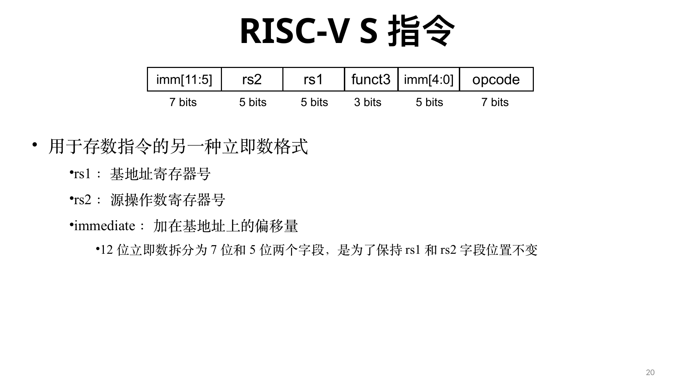

常考格式：

| 格式 | 典型指令 | 关键字段 |
|:---|:---|:---|
| R 型 | `add`, `sub`, `and`, `or` | `funct7 rs2 rs1 funct3 rd opcode` |
| I 型 | `addi`, `lw`, `jalr` | `imm``[``11:0``]`` rs1 funct3 rd opcode` |
| S 型 | `sw` | `imm``[``11:5``]`` rs2 rs1 funct3 imm``[``4:0``]`` opcode` |
| B 型 | `beq`, `bne`, `blt` | 分支立即数被拆散存放，目标地址 PC 相对 |
| U 型 | `lui`, `auipc` | 高 20 位立即数 |
| J 型 | `jal` | 跳转立即数被拆散存放，目标地址 PC 相对 |

答题时先判断“读几个寄存器、写不写寄存器、访不访存、改不改 PC”。

## 2.4 数的表示和小端

n 位无符号数范围：

``` math
0 \sim 2^n - 1
```

n 位补码范围：

``` math
-2^{n-1} \sim 2^{n-1}-1
```

负数补码求法：绝对值二进制取反加一。例如 32 位 `-6`：

6 = 0x00000006 -6 = 0xFFFFFFFA

小端存储：低地址放最低有效字节。所以 `0xFFFFFFFA` 从低地址到高地址依次是：

FA FF FF FF

这类题的正确判断是 `0xFA, 0xFF, 0xFF, 0xFF`。

符号扩展：把最高符号位复制到新增高位。例如 8 位 `11111010` 扩展到 32 位是 `11111111 11111111 11111111 11111010`。

零扩展：高位补 0，常用于无符号数或逻辑立即数。

## 2.5 分支、循环和寻址

条件分支：

- `beq rs1,rs2,label`：相等跳转。

- `bne rs1,rs2,label`：不等跳转。

- `blt`, `bge`：有符号比较。

- `bltu`, `bgeu`：无符号比较。

循环翻译套路：

**while** (i \< n) { sum += a\[i\]; i++; }

对应汇编思路：

1.  比较 `i` 和 `n`，不满足就跳出。

2.  计算地址 `base + i * element_size`。

3.  `lw` 取数组元素。

4.  累加。

5.  `i++` 后跳回循环头。

数组访问常考点：

- `int` 通常 4 字节，索引 `i` 要左移 2 位得到字节偏移。

- RISC-V 的 `lw rd,offset(rs1)` 地址是 `rs1 + sign_extend(offset)`。

- `sw rs2,offset(rs1)` 写入内存地址 `rs1 + offset`，写入值来自 `rs2`。

## 2.6 翻译、链接和装载

从 C 程序到运行：

C 源程序 -\> 编译器 -\> 汇编程序 -\> 汇编器 -\> 目标文件 -\> 链接器 -\> 可执行文件 -\> 装载器 -\> 内存中运行

要点：

- 编译器生成汇编代码。

- 汇编器生成目标模块，包含机器码、符号表、重定位信息。

- 链接器合并目标模块和库，解析外部符号。

- 装载器把程序放入内存，初始化寄存器和栈，然后跳到入口。

# 3. 计算机的算术运算

本章不是只背公式，更要知道每一串位要按哪种“解释方式”理解。相同位串按无符号、补码、浮点解释会得到不同值。

## 3.1 整数加减和溢出

补码加法直接按二进制相加，丢弃最高进位。溢出判断：

- 两个正数相加得到负数，溢出。

- 两个负数相加得到正数，溢出。

- 一正一负相加不会溢出。

无符号加法溢出看最高进位；有符号补码溢出看符号是否异常。

减法可以转成加法：

``` math
a - b = a + (-b)
```

## 3.2 乘法和除法

乘法硬件基本思想：

- 被乘数按乘数每一位决定是否加到积中。

- 每轮移位，类似手算二进制乘法。

- 优化乘法器通过并行加法树或 Booth 编码减少周期。

除法硬件基本思想：

- 试减除数，若结果非负则商位为 1，否则恢复。

- 每轮移位，类似长除法。

RISC-V 中乘除法通常由 M 扩展提供：

- `mul`：低位乘积。

- `mulh`, `mulhu`, `mulhsu`：高位乘积，区分有符号/无符号。

- `div`, `divu`：除法。

- `rem`, `remu`：余数。

## 3.3 浮点表示

IEEE 754 规格化浮点数：

``` math
x = (-1)^s \times (1.fraction) \times 2^{E-bias}
```

| 类型          | 总位数 | 符号位 | 指数位 | 尾数位 | 偏置 |
|:--------------|-------:|-------:|-------:|-------:|-----:|
| 单精度 float  |     32 |      1 |      8 |     23 |  127 |
| 双精度 double |     64 |      1 |     11 |     52 | 1023 |

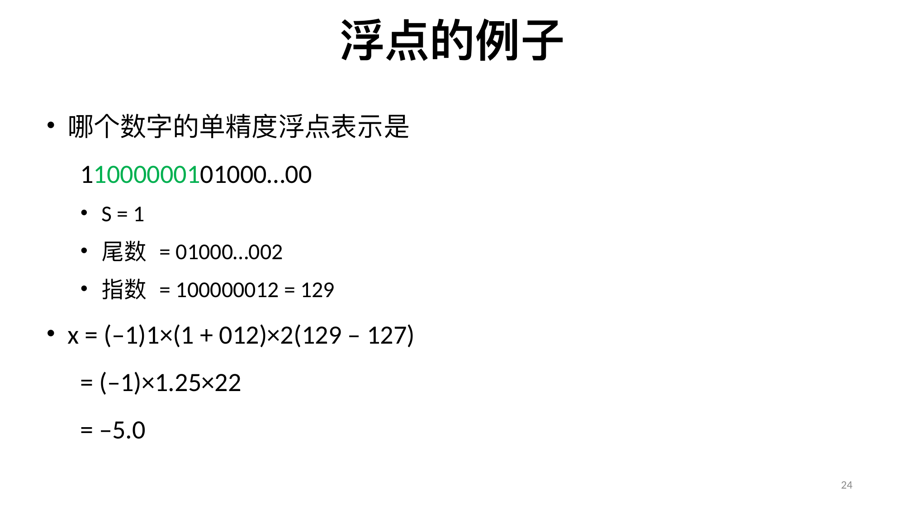

特殊值：

- 指数全 0，尾数全 0：正负 0。

- 指数全 0，尾数非 0：非规格化数，用于表示更接近 0 的数。

- 指数全 1，尾数全 0：正负无穷。

- 指数全 1，尾数非 0：NaN。

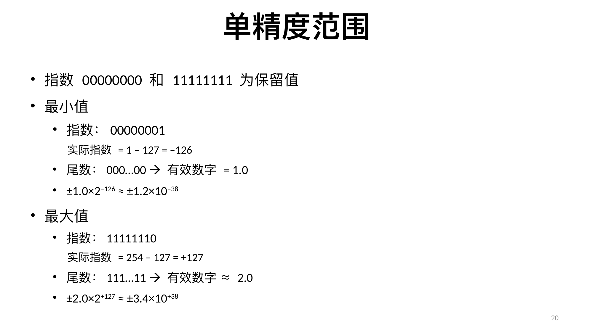

## 3.4 浮点运算步骤

浮点加法常见步骤：

1.  对阶：让两个数指数相同，小指数尾数右移。

2.  尾数加减。

3.  规格化：调整尾数到 `1.xxxx` 形式，并修正指数。

4.  舍入。

5.  检查溢出、下溢和特殊值。

浮点陷阱：

- 浮点数不能精确表示所有十进制小数。

- 加法不满足严格结合律：`(a+b)+c` 可能不等于 `a+(b+c)`。

- 大数加小数时，小数可能因对阶右移而丢失。

# 4. 处理器

第 4 章是全课最像综合题的部分。答题要从“某条指令经过哪些部件、控制信号怎么设、结果写到哪里”入手。

## 4.1 单周期数据通路

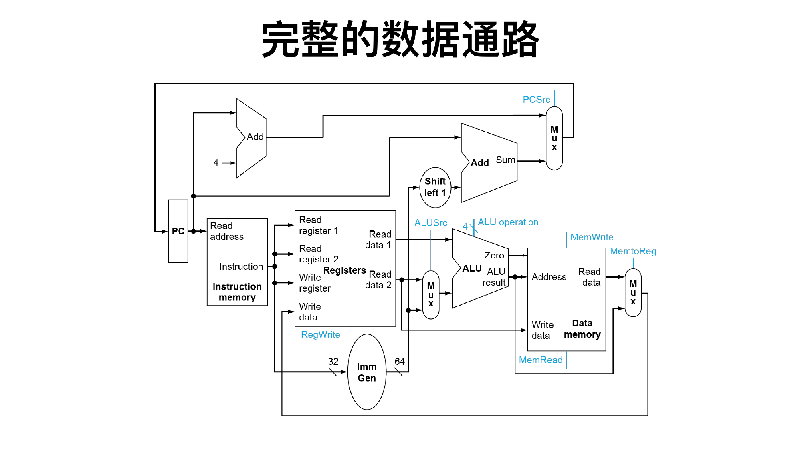

单周期 CPU 每条指令在一个时钟周期内完成，CPI = 1，但时钟周期必须足够长，能容纳最慢指令的路径。

五个常用阶段：

| 阶段 | 动作                              |
|:-----|:----------------------------------|
| IF   | 根据 PC 取指令，同时计算 `PC + 4` |
| ID   | 译码，读寄存器，立即数扩展        |
| EX   | ALU 运算，计算地址，比较分支条件  |
| MEM  | 访问数据存储器，load 或 store     |
| WB   | 写回寄存器                        |

虽然单周期不是流水线，但分析单条指令时也常按这五步说。

## 4.2 控制信号

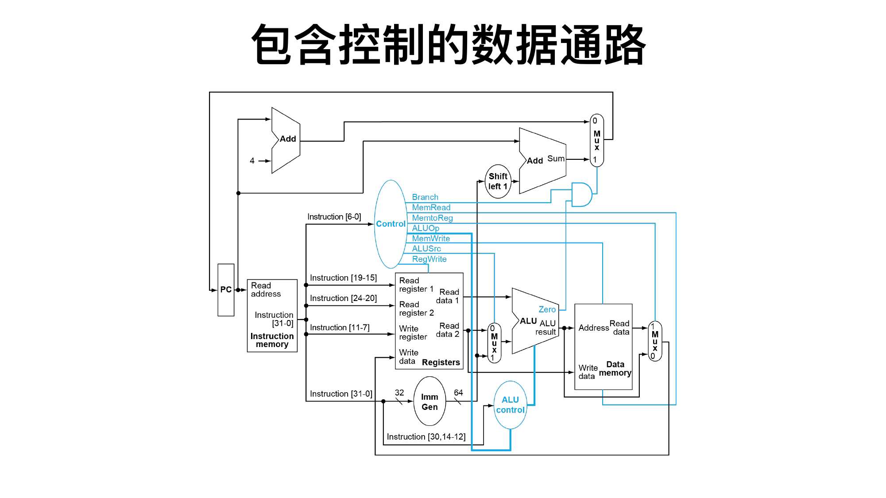

常见指令控制信号：

<table>
<thead>
<tr>
<th style="text-align: left;"><p>指令</p>
</th>
<th style="text-align: left;"><p>RegWrite</p>
</th>
<th style="text-align: left;"><p>ALUSrc</p>
</th>
<th style="text-align: left;"><p>MemRead</p>
</th>
<th style="text-align: left;"><p>MemWrite</p>
</th>
<th style="text-align: left;"><p>MemtoReg</p>
</th>
<th style="text-align: left;"><p>Branch</p>
</th>
<th style="text-align: left;"><p>ALU 操作</p>
</th>
</tr>
</thead>
<tbody>
<tr>
<td style="text-align: left;">R 型 <code>add/sub</code></td>
<td style="text-align: left;"></td>
<td style="text-align: left;"></td>
<td style="text-align: left;"></td>
<td style="text-align: left;"></td>
<td style="text-align: left;"></td>
<td style="text-align: left;"></td>
<td style="text-align: left;">由 funct 字段决定</td>
</tr>
<tr>
<td style="text-align: left;"><code>addi</code></td>
<td style="text-align: left;"></td>
<td style="text-align: left;"></td>
<td style="text-align: left;"></td>
<td style="text-align: left;"></td>
<td style="text-align: left;"></td>
<td style="text-align: left;"></td>
<td style="text-align: left;">加法</td>
</tr>
<tr>
<td style="text-align: left;"><code>lw</code></td>
<td style="text-align: left;"></td>
<td style="text-align: left;"></td>
<td style="text-align: left;"></td>
<td style="text-align: left;"></td>
<td style="text-align: left;"></td>
<td style="text-align: left;"></td>
<td style="text-align: left;">地址加法</td>
</tr>
<tr>
<td style="text-align: left;"><code>sw</code></td>
<td style="text-align: left;"></td>
<td style="text-align: left;"></td>
<td style="text-align: left;"></td>
<td style="text-align: left;"></td>
<td style="text-align: left;">x</td>
<td style="text-align: left;"></td>
<td style="text-align: left;">地址加法</td>
</tr>
<tr>
<td style="text-align: left;"><code>beq</code></td>
<td style="text-align: left;"></td>
<td style="text-align: left;"></td>
<td style="text-align: left;"></td>
<td style="text-align: left;"></td>
<td style="text-align: left;">x</td>
<td style="text-align: left;"></td>
<td style="text-align: left;">减法/比较</td>
</tr>
</tbody>
</table>

答综合题时按下面模板：

1.  指令类型：R/I/S/B/J。

2.  读寄存器：`rs1`、`rs2` 分别是谁。

3.  ALU 输入：第一个通常来自 `rs1`，第二个来自 `rs2` 或立即数。

4.  ALU 操作：加、减、与、或、比较、地址计算。

5.  访存：是否读/写数据存储器，地址是什么，数据是什么。

6.  写回：是否写寄存器，写哪个寄存器，写 ALU 结果还是内存数据。

7.  PC：`PC+4`、分支目标还是跳转目标。

## 4.3 样题程序的数据通路分析

addi x5,x0,10 addi x6,x0,20 add x7,x5,x6 lw x8,0(x7) sw x8,4(x7)

逐条结果：

| 指令 | ALU 输入 | ALU 操作 | 访存 | 写回 |
|:---|:---|:---|:---|:---|
| `addi x5,x0,10` | `0`, `10` | 加 | 无 | `x5 = 10` |
| `addi x6,x0,20` | `0`, `20` | 加 | 无 | `x6 = 20` |
| `add x7,x5,x6` | `10`, `20` | 加 | 无 | `x7 = 30` |
| `lw x8,0(x7)` | `30`, `0` | 地址加法 | 读 `Mem``[``30``]` | `x8 = Mem``[``30``]` |
| `sw x8,4(x7)` | `30`, `4` | 地址加法 | 写 `Mem``[``34``]`` = x8` | 无 |

注意：如果题目没有给出 `Mem``[``30``]` 的初值，就不能给出 `x8` 的具体数值，只能写 `x8 = Mem``[``30``]`。

## 4.4 流水线

理想五级流水线：

IF -\> ID -\> EX -\> MEM -\> WB

流水线提高的是吞吐率，不减少单条指令延迟。理想情况下，k 级流水线执行 n 条指令需要：

``` math
n + k - 1
```

个周期。n 很大时，理想加速比接近 k。

本章小结里的核心句：

- 流水线通过并行执行多条指令提高吞吐率。

- 每条指令的延迟基本不变。

- 性能受结构冒险、数据冒险、控制冒险制约。

- ISA 会影响流水线实现复杂度。

## 4.5 数据冒险、旁路和阻塞

数据冒险：后一条指令需要前一条尚未写回的结果。

常见 RAW 相关：

add x1,x2,x3 sub x4,x1,x5

`sub` 在 ID/EX 阶段需要 `x1`，但 `add` 的结果还没写回。解决办法：

- 旁路/前递：从 EX/MEM 或 MEM/WB 直接把结果送到 ALU 输入。

- 阻塞：插入气泡，等数据可用。

- 编译器调度：重排无关指令填空。

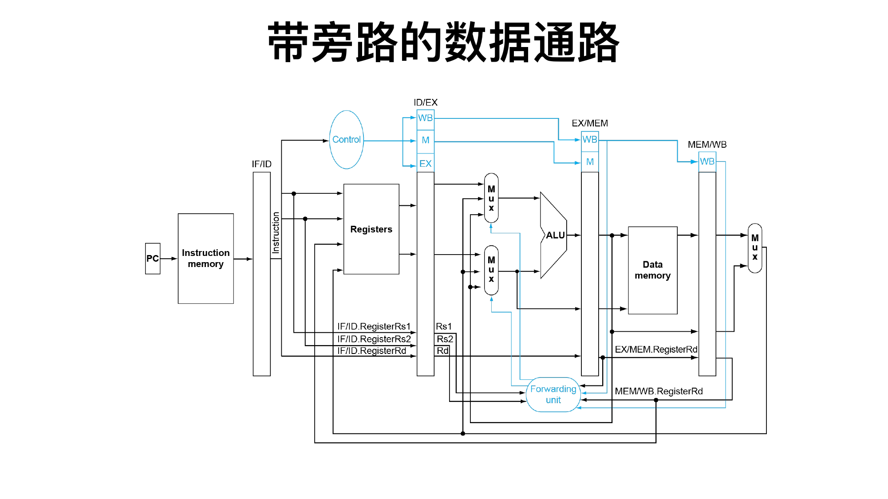

旁路判断条件常见写法：

EX hazard: EX/MEM.RegWrite and EX/MEM.Rd != 0 and EX/MEM.Rd == ID/EX.Rs1 or Rs2

MEM hazard: MEM/WB.RegWrite and MEM/WB.Rd != 0 and MEM/WB.Rd == ID/EX.Rs1 or Rs2

取数-使用型冒险 load-use：

lw x1,0(x2) add x3,x1,x4

即使有旁路也通常要阻塞 1 个周期，因为 load 数据到 MEM 末尾才出来，下一条的 EX 阶段太早。

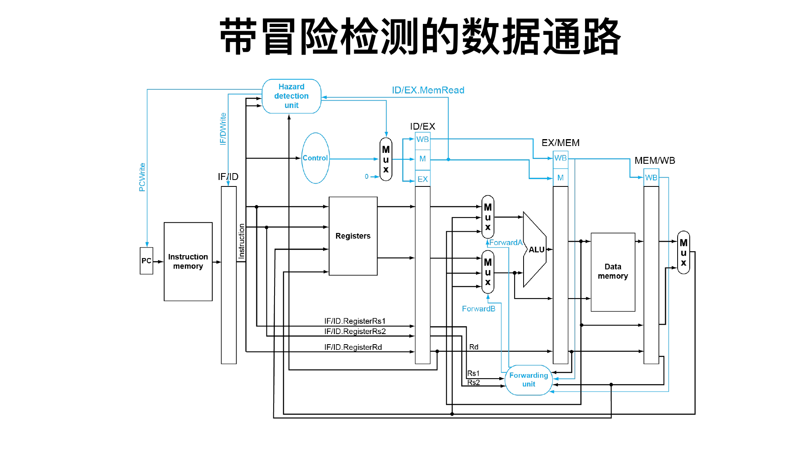

load-use 阻塞条件：

ID/EX.MemRead and (ID/EX.Rd == IF/ID.Rs1 or ID/EX.Rd == IF/ID.Rs2)

阻塞动作：

- PC 不更新。

- IF/ID 寄存器不更新。

- ID/EX 控制信号清 0，插入 bubble。

## 4.6 控制冒险

控制冒险来自分支和跳转。若分支结果晚到，处理器可能已经取了错误路径上的指令。

解决办法：

- 阻塞到分支结果确定。

- 提前在 ID 阶段比较寄存器并计算目标地址。

- 静态预测：总是假设不跳或总是假设跳。

- 动态预测：用分支历史表、1 位/2 位预测器。

- 预测错误时 flush 错误路径指令。

答题关键词：flush、stall、branch penalty、prediction accuracy。

## 4.7 异常和中断

异常来自当前指令内部，例如非法指令、算术溢出、缺页。中断通常来自外部设备。

处理流程：

1.  保存异常 PC。

2.  记录异常原因。

3.  跳转到异常处理程序。

4.  处理后返回或终止程序。

流水线中理想目标是精确异常：异常发生时，看起来像前面的指令都完成、后面的指令都没执行。

# 5. 存储器层次结构

第 5 章公式多、概念也多：Cache 地址分解、命中/缺失、AMAT、多核 Cache 一致性都要会。

## 5.1 局部性和层次结构

局部性原理：

- 时间局部性：刚访问过的数据/指令，很可能很快再次访问。

- 空间局部性：访问了某地址，附近地址很可能也会访问。

存储层次从快到慢、从小到大大致是：

寄存器 -\> L1 Cache -\> L2 Cache -\> L3 Cache -\> DRAM -\> SSD/HDD

选择题中“访问速度最快”通常选高速缓存 Cache，而不是内存、硬盘或光盘。

## 5.2 Cache 地址分解

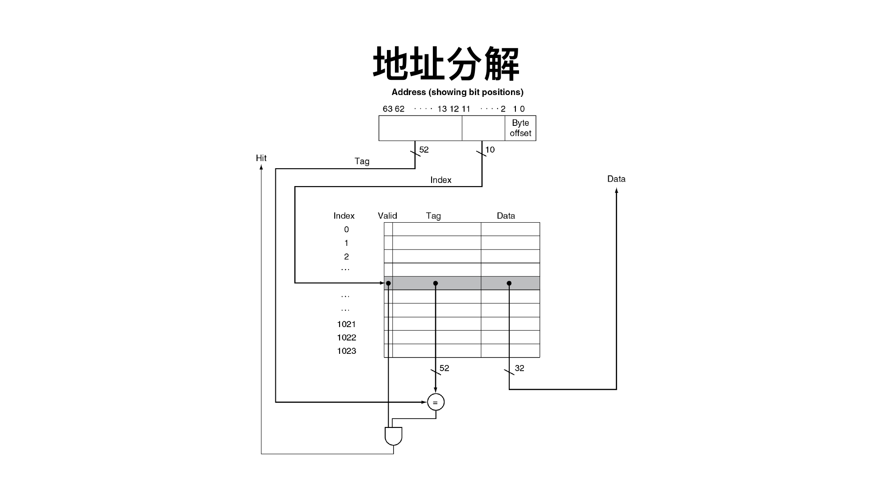

核心公式：

块内偏移位数 = log2(块大小，单位字节) 组索引位数 = log2(组数) 组数 = Cache 容量 / (块大小 × 相联度) 标记位数 = 地址位数 - 组索引位数 - 块内偏移位数

直接映射是 1 路组相联。全相联没有索引位，任意块可放任意位置。

查找流程：

1.  用 index 找到组。

2.  比较 tag。

3.  valid 位为 1 且 tag 匹配，则命中。

4.  用 offset 选择块内字节/字。

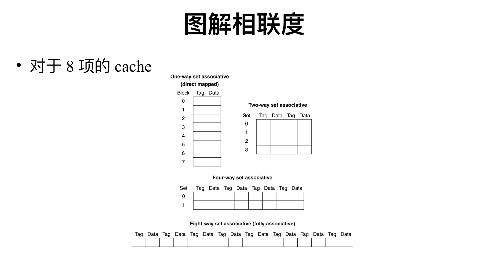

相联度权衡：

- 直接映射：硬件简单，命中时间短，但冲突缺失多。

- 组相联：减少冲突缺失，但比较器更多，命中时间可能变长。

- 全相联：冲突最少，但硬件最复杂。

## 5.3 Cache 写策略

写命中策略：

- 写直达 write-through：同时写 Cache 和下一级存储器。实现简单，下层数据新，但写流量大，常配写缓冲。

- 写回 write-back：只写 Cache，置 dirty 位，替换时再写回。写流量小，但一致性更复杂。

写缺失策略：

- 写分配 write-allocate：缺失时把块调入 Cache 再写。

- 非写分配 no-write-allocate：缺失时直接写下一级，不调入 Cache。

常见组合：

- 写回 + 写分配。

- 写直达 + 非写分配。

## 5.4 AMAT 和性能

平均访问时间：

``` math
AMAT = Hit\ Time + Miss\ Rate \times Miss\ Penalty
```

多级 Cache：

``` math
AMAT = L1HitTime + L1MissRate \times (L2HitTime + L2MissRate \times MemoryPenalty)
```

内存阻塞周期：

``` math
Memory\ Stall\ Cycles = Memory\ Accesses \times Miss\ Rate \times Miss\ Penalty
```

若按每条指令算：

``` math
Memory\ Stall\ Cycles/Instruction = Accesses/Instruction \times Miss\ Rate \times Miss\ Penalty
```

本章小结强调：CPU 越快，Cache miss 的相对代价越大。只优化 CPU 而忽视 Cache，整体性能可能上不去。

## 5.5 缺失类型

3C 模型：

- 强制缺失 compulsory miss：第一次访问某块，Cache 中不可能有。

- 容量缺失 capacity miss：Cache 太小，放不下工作集。

- 冲突缺失 conflict miss：相联度不够，多个块竞争同一位置。

优化方向：

- 增大块大小：利用空间局部性，但太大会增加缺失代价和污染。

- 增大 Cache：降低容量缺失，但可能增加命中时间。

- 增大相联度：降低冲突缺失，但硬件复杂。

- 多级 Cache：兼顾 L1 快和低层容量大。

## 5.6 虚拟存储和 TLB

虚拟地址分为：

Virtual Page Number \| Page Offset

页内偏移不变，虚拟页号通过页表翻译成物理页号。

TLB 是页表项的 Cache：

- TLB 命中：直接得到物理页号。

- TLB 缺失：查页表，把页表项装入 TLB。

- 页表项无效：发生缺页异常，从磁盘调页。

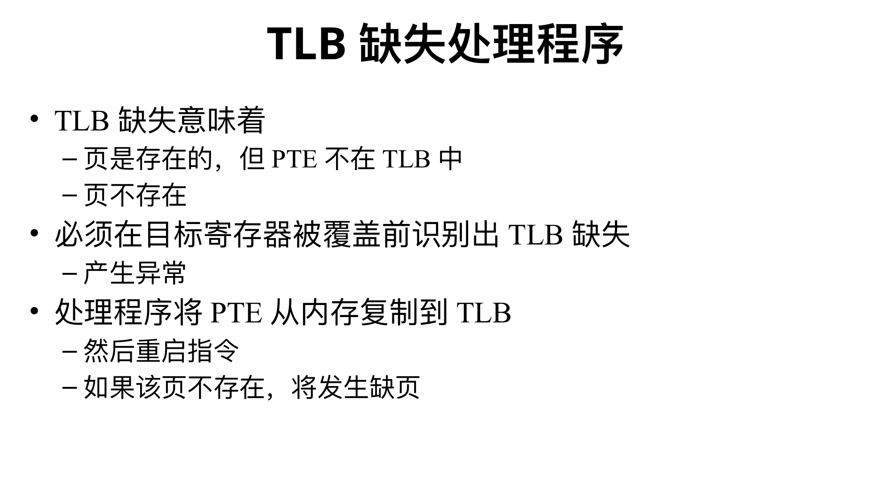

缺页代价很大，所以页面通常很大，替换策略也更谨慎。虚拟存储的好处：

- 给每个程序独立地址空间。

- 支持保护。

- 让程序认为自己有连续大内存。

- 只把活跃页面装入内存。

## 5.7 Cache 一致性和存储器一致性

多核中，每个核有自己的 Cache。若多个 Cache 持有同一块，某核写入后其他核的旧副本会导致不一致。

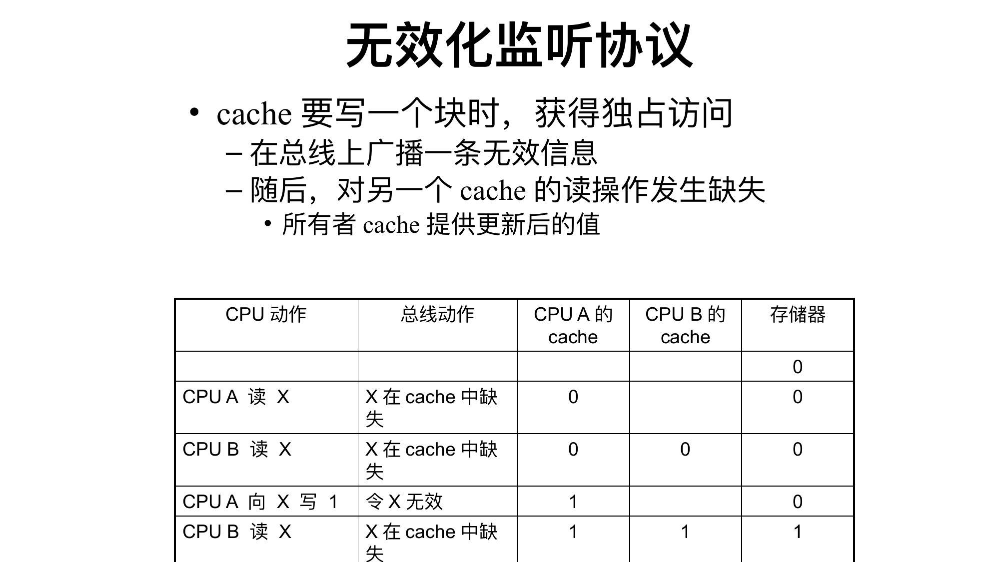

一致性需要保证：

- 写传播：一个核的写最终能被其他核看到。

- 写串行化：所有核看到同一地址的写入顺序一致。

常见协议：

- 监听式 snooping：所有 Cache 监听总线事务。

- 无效化 invalidation：写前让其他副本失效。

- 更新 update：写后把新值发给其他副本。

- 目录式 directory：由目录记录哪些 Cache 持有某块，适合大规模多处理器。

简答题要区分：

- Cache coherence：同一地址的多个缓存副本是否一致。

- Memory consistency：不同地址的读写在多处理器中按什么顺序可见。

## 5.8 可靠性和校验

常见术语：

- MTTF：平均无故障时间。

- MTTR：平均修复时间。

- 可用性：

``` math
Availability = \frac{MTTF}{MTTF + MTTR}
```

ECC：

- 奇偶校验能发现单比特错误，但不能纠正。

- SEC：single error correction，可纠正 1 位错误。

- DED：double error detection，可发现 2 位错误。

- SEC/DED 常用于内存可靠性。

# 6. 并行处理器

第 6 章多为概念题和公式题。核心是：并行能提高性能，但受串行部分、通信、同步、内存带宽和编程难度限制。

## 6.1 Amdahl 定律

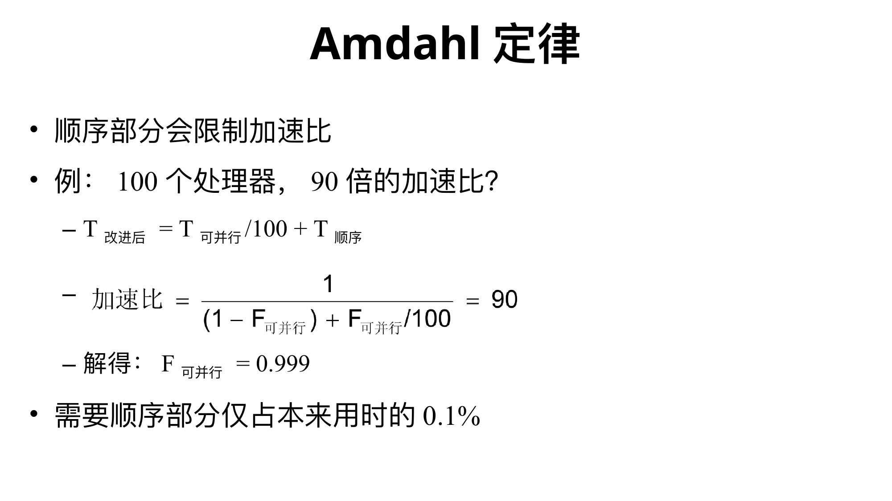

若程序中比例为 `F` 的部分被加速 `S` 倍，总加速比：

``` math
Speedup = \frac{1}{(1-F)+\frac{F}{S}}
```

极限：当 `S` 无限大时，

``` math
Speedup_{max} = \frac{1}{1-F}
```

含义：串行部分会限制总加速比。想靠更多处理器获得接近线性的加速，串行部分必须极小。

强比例缩放和弱比例缩放：

- 强比例缩放：问题规模固定，处理器更多，运行时间应下降。

- 弱比例缩放：每个处理器负载固定，处理器更多，问题规模同步变大。

## 6.2 SIMD、向量和多线程

Flynn 分类：

| 类型 | 指令流 | 数据流 | 例子                           |
|:-----|:-------|:-------|:-------------------------------|
| SISD | 单     | 单     | 传统单核顺序处理               |
| SIMD | 单     | 多     | 向量处理器、GPU warp、媒体扩展 |
| MIMD | 多     | 多     | 多核、多处理器、集群           |
| MISD | 多     | 单     | 少见                           |

SIMD 适合规则数据并行，例如数组加法、矩阵运算、图像处理。缺点是分支发散和数据不规则会降低效率。

多线程：

- 细粒度多线程：每周期切换线程，隐藏延迟。

- 粗粒度多线程：遇到长延迟事件才切换。

- 同时多线程 SMT：同一周期发射多个线程的指令，提高硬件利用率。

## 6.3 GPU 和共享内存

GPU 特点：

- 大量简单计算核心。

- 高吞吐，适合数据并行。

- 内存层次复杂，带宽高但延迟也高。

- 分支发散、非合并访存会拖慢性能。

共享内存多处理器：

- 多个处理器共享同一地址空间。

- 程序员通过锁、信号量、原子操作同步。

- 难点是竞争、死锁、负载均衡和 Cache 一致性。

消息传递：

- 每个节点有独立地址空间。

- 通过 send/receive 通信。

- 适合集群，但通信开销和数据划分很关键。

## 6.4 Roofline 模型

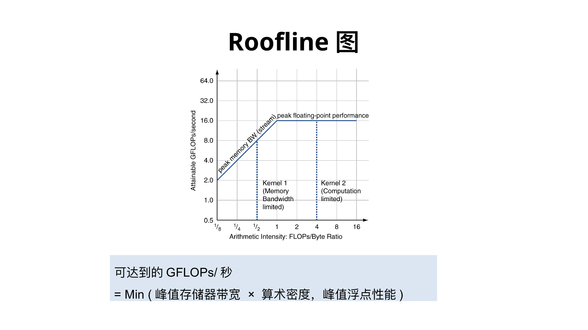

Roofline 用两个瓶颈估计性能：

``` math
Attainable\ Performance = \min(Peak\ Compute,\ Memory\ Bandwidth \times Operational\ Intensity)
```

其中 operational intensity 是：

``` math
\frac{Operations}{Bytes\ Transferred}
```

判断：

- 若算术强度低，性能受内存带宽限制。

- 若算术强度高，性能受峰值计算能力限制。

# 7. 常见题型模板

## 7.1 选择题速记

- 访问速度：寄存器最快，其次 Cache，再次主存，磁盘/光盘最慢。若选项是 Cache、内存、硬盘、光盘，选 Cache。

- 小端：低地址放低有效字节。`0x12345678` 低地址到高地址是 `78 56 34 12`。

- 补码：负数不是反码存储，而是补码存储。

- 流水线：提高吞吐率，不降低单条指令延迟。

- Cache miss 代价会随 CPU 变快而更明显。

- `x0` 永远是 0，写 `x0` 无效。

- `lw` 写寄存器，`sw` 不写寄存器。

- `beq` 通常不写寄存器，只可能改变 PC。

## 7.2 简答题模板

答结构比较题：

先定义 A 和 B。 再分别写 A 的优点、缺点。 再写 B 的优点、缺点。 最后写现代系统如何折中使用。

答 Cache/流水线问题：

先说明问题是什么。 再说明问题为什么会发生。 再给硬件方案。 再给软件/编译器方案。 最后补一句性能权衡。

## 7.3 综合题解题顺序

RISC-V 程序执行：

1.  写出每条指令的语义。

2.  更新寄存器。

3.  load/store 若内存值未知，保留符号表达式。

4.  分支/跳转要更新 PC。

5.  最后按题目问的寄存器或内存地址给答案。

单周期数据通路：

1.  判断指令类型。

2.  找 `rs1`、`rs2`、`rd` 和立即数。

3.  写 ALU 两个输入。

4.  写 ALU 操作。

5.  写是否访问数据存储器。

6.  写写回来源和目标寄存器。

7.  写 PC 选择。

Cache 题：

1.  算块大小对应的 offset 位。

2.  算组数和 index 位。

3.  剩下是 tag 位。

4.  对每个地址分解 tag/index/offset。

5.  根据 valid、tag、替换规则判断 hit/miss。

6.  用 AMAT 或 miss penalty 算性能。

流水线题：

1.  画 IF/ID/EX/MEM/WB 时间表。

2.  找 RAW 相关。

3.  看能否旁路。

4.  load-use 通常插 1 个 bubble。

5.  分支按题目设定处理：阻塞、预测或 flush。

# 8. 完整例题

本章把前面的知识点串成完整推理过程。

## 8.1 一条 C 语句怎样变成硬件动作

先用一条简单语句建立全局图景：

c = a + b;

如果 `a`、`b`、`c` 都在内存里，处理器不能直接让内存和内存相加。RISC-V 是 load/store 架构，所以必须先把内存数据取到寄存器：

lw x5, 0(x10) \# x5 = a lw x6, 0(x11) \# x6 = b add x7, x5, x6 \# x7 = a + b sw x7, 0(x12) \# c = x7

这段程序串起几个核心环节：

- 指令系统回答“软件怎样命令硬件”：`lw`、`add`、`sw` 是 ISA 的一部分。

- 数据表示回答“位串是什么意思”：`x5` 里的 32/64 位按补码、无符号或浮点解释会得到不同值。

- 处理器回答“一条指令怎样执行”：取指、译码、读寄存器、ALU、访存、写回。

- 存储系统回答“内存为什么看起来够快”：大多数 `lw/sw` 先访问 Cache，不是每次都去 DRAM。

- 并行处理回答“怎样进一步变快”：多个核心、SIMD、GPU、流水线同时工作，但会遇到依赖、通信和一致性问题。

因此做题时要先定位题目属于哪一层：

| 题目问法           | 所属层次     | 第一反应                         |
|:-------------------|:-------------|:---------------------------------|
| 某寄存器最后是多少 | ISA/程序执行 | 逐条写语义，更新寄存器           |
| ALU 输入是什么     | 数据通路     | 找 `rs1`、`rs2/imm`，看 `ALUSrc` |
| 是否命中 Cache     | 存储层次     | 分解地址：tag/index/offset       |
| 流水线停几个周期   | 微体系结构   | 找 RAW、load-use、分支           |
| 加速比是多少       | 性能/并行    | 套 CPU 时间或 Amdahl 公式        |

## 8.2 性能题从零推导

性能题不要上来就套一个公式，先问自己“题目给的是时间、频率、CPI 还是指令数”。

核心关系只有一个：

``` math
CPU\ Time = Instruction\ Count \times CPI \times Clock\ Cycle\ Time
```

由于：

``` math
Clock\ Cycle\ Time = \frac{1}{Clock\ Rate}
```

所以：

``` math
CPU\ Time = \frac{Instruction\ Count \times CPI}{Clock\ Rate}
```

### 例题 1：比较两台机器

机器 A：指令数 `10^9`，CPI = 2，频率 2 GHz。

机器 B：指令数 `1.2 × 10^9`，CPI = 1.5，频率 1.5 GHz。

计算：

A 时间 = 10^9 × 2 / (2 × 10^9) = 1 s B 时间 = 1.2 × 10^9 × 1.5 / (1.5 × 10^9) = 1.2 s

所以 A 更快。A 相对 B 的性能比：

``` math
\frac{Performance_A}{Performance_B}=\frac{Time_B}{Time_A}=1.2
```

即 A 快 20%。

### 例题 2：CPI 由指令组合决定

某程序有三类指令：

| 指令类型   | 比例 | CPI |
|:-----------|-----:|----:|
| ALU        |  50% |   1 |
| Load/Store |  30% |   2 |
| Branch     |  20% |   3 |

平均 CPI：

``` math
CPI = 0.5 \times 1 + 0.3 \times 2 + 0.2 \times 3 = 1.7
```

如果指令数是 `2 × 10^9`，频率是 2 GHz：

``` math
CPU\ Time = \frac{2 \times 10^9 \times 1.7}{2 \times 10^9}=1.7s
```

易错点：

- 平均 CPI 是加权平均，不是简单平均。

- 指令比例要按动态执行次数算，不是按程序源码行数算。

- 优化某类指令要看它占比。很少出现的指令即使加速很多，总体收益也有限。

### 例题 3：Amdahl 思想也适用于普通优化

程序 40% 时间花在乘法上。现在把乘法加速 4 倍。总加速比：

``` math
Speedup=\frac{1}{(1-0.4)+0.4/4}=\frac{1}{0.6+0.1}=1.43
```

不是 4 倍，因为只有 40% 的时间被优化了。

## 8.3 补码、小端和符号扩展彻底讲清楚

二进制位本身没有“正负”的含义，关键看指令怎样解释它。

同一个 8 位位串：

1111 1010

如果按无符号解释：

``` math
250
```

如果按补码解释：

最高位是 1，表示负数。求值方法之一：

1111 1010 取反 -\> 0000 0101 加 1 -\> 0000 0110 = 6 所以原数是 -6

所以 `11111010` 是 8 位补码 `-6`。

### 32 位 -6 的小端存储

32 位 `+6`：

0x00000006

取反加一得到 `-6`：

0xFFFFFFFA

按字节拆开：

FF FF FF FA

这是“从高有效字节到低有效字节”的书写顺序。小端存储要把最低有效字节放低地址，所以内存从低地址到高地址是：

FA FF FF FF

这就是示例里选 `0xFA, 0xFF, 0xFF, 0xFF` 的原因。

### 符号扩展为什么复制最高位

8 位 `-6`：

1111 1010

扩展到 32 位：

11111111 11111111 11111111 11111010

如果高位补 0，会变成：

00000000 00000000 00000000 11111010 = 250

值就错了。补码符号扩展复制符号位，才能保持数值不变。

### 溢出判断口诀

有符号加法：

- 正 + 正 = 负，溢出。

- 负 + 负 = 正，溢出。

- 正 + 负，不会溢出。

例：8 位补码 `100 + 60`：

0110 0100 = 100 + 0011 1100 = 60 = 1010 0000

结果最高位是 1，按 8 位补码是负数，但两个正数相加不可能得到负数，所以溢出。

## 8.4 RISC-V 做题：先把指令翻译成人话

看到 RISC-V 代码，不要急着画数据通路。先逐条翻译。

| 指令                  | 人话语义                               |
|:----------------------|:---------------------------------------|
| `add rd,rs1,rs2`      | `rd = rs1 + rs2`                       |
| `sub rd,rs1,rs2`      | `rd = rs1 - rs2`                       |
| `addi rd,rs1,imm`     | `rd = rs1 + sign_extend(imm)`          |
| `lw rd,offset(rs1)`   | `rd = Mem``[``rs1 + offset``]`         |
| `sw rs2,offset(rs1)`  | `Mem``[``rs1 + offset``]`` = rs2`      |
| `beq rs1,rs2,L`       | 如果 `rs1 == rs2`，跳到 L              |
| `bne rs1,rs2,L`       | 如果 `rs1 != rs2`，跳到 L              |
| `jal rd,L`            | `rd = PC + 4`，然后跳到 L              |
| `jalr rd,offset(rs1)` | `rd = PC + 4`，然后跳到 `rs1 + offset` |

### 例题：数组求和的汇编骨架

C 代码：

int sum = 0; **for** (int i = 0; i \< n; i++) { sum += a\[i\]; }

设：

- `x10` 是数组首地址 `a`

- `x11` 是 `n`

- `x5` 是 `i`

- `x6` 是 `sum`

- `x7` 临时保存偏移/地址

- `x8` 临时保存数组元素

汇编思路：

addi x5, x0, 0 \# i = 0 addi x6, x0, 0 \# sum = 0 loop: bge x5, x11, done \# i \>= n 则结束 slli x7, x5, 2 \# int 是 4 字节，偏移 = i \* 4 add x7, x10, x7 \# 地址 = a + i\*4 lw x8, 0(x7) \# x8 = a\[i\] add x6, x6, x8 \# sum += a\[i\] addi x5, x5, 1 \# i++ jal x0, loop \# 无条件跳回 done:

做这类题的关键不是背代码，而是理解三步：

1.  比较循环条件。

2.  计算数组元素地址。

3.  load 元素并更新累加变量。

### 函数调用为什么要用栈

函数调用至少要处理三件事：

- 参数怎样传进去。

- 返回值怎样传出来。

- 调用完怎样回到原位置。

RISC-V 常用约定：

- `a0-a7` 传参数和返回值。

- `ra` 保存返回地址。

- `sp` 指向栈顶。

- `s0-s11` 是被调用者保存寄存器。

- `t0-t6` 是调用者保存寄存器。

非叶子过程会调用别的函数，所以它自己的 `ra` 会被新的 `jal` 覆盖。进入函数时必须把旧 `ra` 存到栈里：

addi **sp**, **sp**, -16 sw ra, 12(**sp**) sw s0, 8(**sp**)

\# 函数体，可能调用别的函数

lw s0, 8(**sp**) lw ra, 12(**sp**) addi **sp**, **sp**, 16 jalr x0, 0(ra)

栈帧的直觉：

高地址 \| 调用者的数据 \| \| 保存的 ra \| \| 保存的 s0 \| \| 局部变量 \| \<- sp 低地址

栈通常向低地址增长，所以分配栈帧是 `sp` 减小，释放栈帧是 `sp` 增大。

## 8.5 指令格式和立即数：不要死背，要按用途理解

RISC-V 把常用指令做成固定 32 位，是为了让取指和译码简单。不同格式本质上是为了容纳不同数量的寄存器和立即数。

R 型需要三个寄存器：

add rd, rs1, rs2

所以格式里要有 `rd`、`rs1`、`rs2`。

I 型需要两个寄存器和一个立即数：

addi rd, rs1, imm lw rd, imm(rs1)

所以格式里有 `rd`、`rs1` 和 12 位立即数。

S 型是 store：

sw rs2, imm(rs1)

它不写寄存器，所以没有 `rd`。但是要读两个寄存器：

- `rs1` 作为基地址。

- `rs2` 作为要写入内存的数据。

B 型是 branch：

beq rs1, rs2, label

它不写寄存器，所以没有 `rd`；需要两个源寄存器做比较，还需要 PC 相对偏移。

J 型是 jump：

jal rd, label

它需要写 `rd = PC + 4`，还需要比较大的跳转偏移。

做编码题时先写字段，不要先写二进制：

opcode 是哪类指令 rd 是谁 funct3/funct7 决定具体操作 rs1/rs2 是谁 imm 如何拆分

## 8.6 浮点数：一眼拆出 S、E、F

单精度浮点格式：

S \| Exponent(8 bits) \| Fraction(23 bits)

规格化数：

``` math
(-1)^S \times (1.F) \times 2^{E-127}
```

双精度只是位数变大：

S \| Exponent(11 bits) \| Fraction(52 bits)

规格化数：

``` math
(-1)^S \times (1.F) \times 2^{E-1023}
```

### 例题：把 -5.0 编成单精度

先写成二进制科学计数法：

5.0 = 101.0_2 = 1.01_2 × 2^2 -5.0 = (-1)^1 × 1.01_2 × 2^2

所以：

S = 1 实际指数 = 2 存储指数 E = 2 + 127 = 129 = 10000001_2 尾数 F = 0100000...0

最终：

1 10000001 01000000000000000000000

这正好对应浮点例题。

### 例题：给定位串求值

位串：

0 10000010 11000000000000000000000

拆：

S = 0 E = 10000010_2 = 130 F = .110000...

实际指数：

130 - 127 = 3

有效数：

1.11_2 = 1 + 1/2 + 1/4 = 1.75

值：

(+1) × 1.75 × 2^3 = 14

### 浮点加法为什么会丢精度

比如：

1.0 × 2^20 + 1.0 × 2^0

对阶时，第二个数要右移 20 位才能和第一个数相加。若尾数位数有限，小数可能完全被移没，结果近似还是第一个大数。

所以浮点不是“实数”，只是有限位宽下的近似。

## 8.7 单周期数据通路：按部件走一遍

单周期数据通路的关键部件：

| 部件         | 作用                           |
|:-------------|:-------------------------------|
| PC           | 保存当前指令地址               |
| 指令存储器   | 根据 PC 取出指令               |
| 寄存器堆     | 读 `rs1/rs2`，写 `rd`          |
| 立即数生成器 | 从指令字段取出并符号扩展立即数 |
| ALU          | 算术逻辑运算、地址计算、比较   |
| 数据存储器   | 执行 `lw/sw`                   |
| 加法器       | 计算 `PC+4` 和分支目标         |
| 多路选择器   | 在多个输入中选一个             |
| 控制器       | 根据 opcode/funct 产生控制信号 |

### `add x7,x5,x6` 怎么走

IF: PC 送入指令存储器，取出 add 指令；同时算 PC+4 ID: 译码，读 x5 和 x6 EX: ALU 做加法，输入是 x5 的值和 x6 的值 MEM: 不访问数据存储器 WB: ALU 结果写回 x7 PC: 选择 PC+4

控制信号：

RegWrite = 1 ALUSrc = 0 MemRead = 0 MemWrite = 0 MemtoReg = 0 Branch = 0 ALUOp = R 型，由 funct3/funct7 决定 add

### `lw x8,0(x7)` 怎么走

IF: 取指令 ID: 读 x7，生成立即数 0 EX: ALU 计算地址 x7 + 0 MEM: 读取 DataMemory\[x7 + 0\] WB: 把内存读出的数据写回 x8 PC: PC+4

控制信号：

RegWrite = 1 ALUSrc = 1 MemRead = 1 MemWrite = 0 MemtoReg = 1 Branch = 0 ALUOp = 加法

### `sw x8,4(x7)` 怎么走

IF: 取指令 ID: 读 x7 和 x8，生成立即数 4 EX: ALU 计算地址 x7 + 4 MEM: 把 x8 的值写到 DataMemory\[x7 + 4\] WB: 不写寄存器 PC: PC+4

控制信号：

RegWrite = 0 ALUSrc = 1 MemRead = 0 MemWrite = 1 MemtoReg = x Branch = 0 ALUOp = 加法

### `beq x5,x6,L` 怎么走

IF: 取指令，算 PC+4 ID: 读 x5 和 x6，生成分支立即数 EX: ALU 比较 x5 和 x6，常用减法判断 Zero MEM: 不访问数据存储器 WB: 不写寄存器 PC: 如果 Branch 且 Zero，则选分支目标，否则选 PC+4

答题时最容易漏的是 PC 选择。分支题一定写出：

PCSrc = Branch and Zero

## 8.8 为什么单周期 CPU 慢，流水线又为什么麻烦

单周期 CPU 的 CPI 是 1，看起来很好，但周期必须按最慢指令设置。通常 `lw` 最慢，因为它要：

取指 -\> 读寄存器 -\> ALU 算地址 -\> 读数据存储器 -\> 写回

即使 `add` 不需要访问数据存储器，也必须等同样长的时钟周期。这就是单周期的浪费。

流水线把一条指令拆成 5 段：

IF ID EX MEM WB

不同指令可以错开执行。

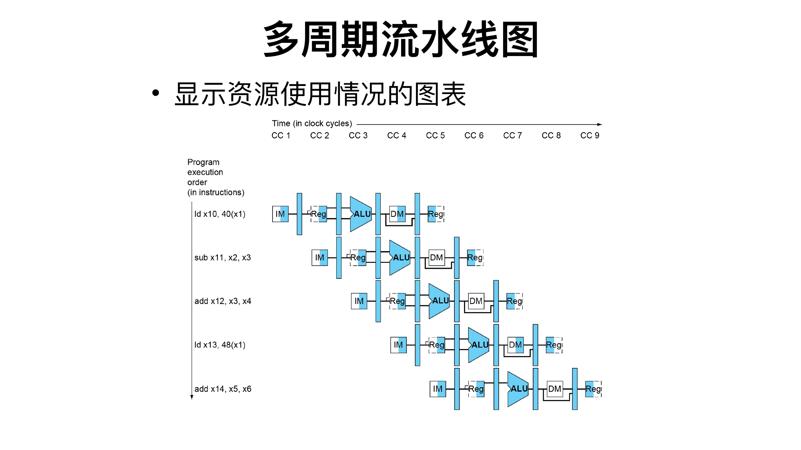

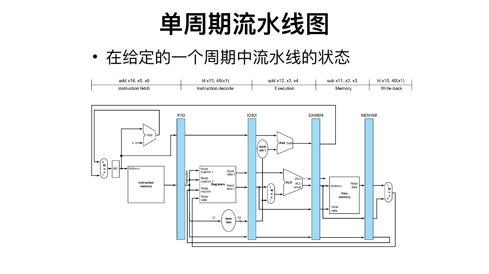

理想情况下，5 级流水线完成 n 条指令需要：

n + 4 个周期

而不是：

5n 个周期

但流水线会出现冒险。

### 结构冒险

硬件资源冲突。例如同一个周期里：

- 一条指令在 IF 阶段要读指令存储器。

- 另一条指令在 MEM 阶段要读/写数据。

如果指令和数据共用一个存储器，就冲突。解决方案：

- 指令存储器和数据存储器分开。

- 或者让流水线暂停。

这也解释了为什么现代处理器常把 L1 I-Cache 和 L1 D-Cache 分开。

### 数据冒险

后一条指令要用前一条指令的结果：

add x1,x2,x3 sub x4,x1,x5

`sub` 在 EX 阶段需要 `x1`，但 `add` 要到 WB 才写回。如果等 WB，会浪费周期。旁路把 ALU 结果直接送给后续指令的 ALU 输入。

时间表直觉：

cycle: 1 2 3 4 5 add: IF ID EX MEM WB sub: IF ID EX MEM WB

`sub` 的 EX 在 cycle 4，而 `add` 的结果在 cycle 3 EX 末尾已经算出，可以从 EX/MEM 旁路过去。

### load-use 为什么旁路还不够

lw x1,0(x2) add x3,x1,x4

时间表：

cycle: 1 2 3 4 5 lw: IF ID EX MEM WB add: IF ID EX MEM WB

`add` 的 EX 在 cycle 4 一开始需要 `x1`，但 `lw` 的数据要到 cycle 4 的 MEM 末尾才从数据存储器出来。太晚了，所以必须插入 1 个 bubble：

cycle: 1 2 3 4 5 6 lw: IF ID EX MEM WB add: IF ID ID EX MEM WB

第二个 `ID` 表示 `add` 在译码级保持 1 拍，同时向 EX 级插入一个 bubble。硬件动作是：

- PC 不更新。

- IF/ID 不更新。

- ID/EX 控制信号清 0，形成 bubble。

### 控制冒险

分支是否跳转要等比较结果出来。若处理器已经取了下一条顺序指令，结果发现分支要跳，就要清掉错误路径的指令。

降低控制冒险代价的方法：

- 提前在 ID 阶段计算分支。

- 分支预测。

- 预测错就 flush。

- 编译器把有用指令放到分支延迟槽，部分 ISA 使用过这种设计。

## 8.9 流水线题完整演练

题目：

lw x1,0(x2) add x3,x1,x4 sub x5,x3,x6 and x7,x5,x8

假设有完整旁路，但 load-use 需要停 1 个周期。画流水线。

第一步找依赖：

lw -\> add: x1，load-use，需要停 1 周期 add -\> sub: x3，ALU 结果，可旁路 sub -\> and: x5，ALU 结果，可旁路

时间表：

cycle: 1 2 3 4 5 6 7 8 9 lw: IF ID EX MEM WB add: IF ID ID EX MEM WB sub: IF IF ID EX MEM WB and: IF ID EX MEM WB

解释：

- `add` 因为要等 `lw` 的数据，在 ID 级保持 1 周期；这一拍 EX 级插入 bubble。

- 停顿时 PC 和 IF/ID 寄存器冻结，所以 `sub` 仍停在 IF；下一条 `and` 不能在第 4 周期取指，必须到第 5 周期才 IF。

- `add -> sub` 和 `sub -> and` 都靠旁路解决，不再额外停顿。

若只问“停几个周期”，答 1 个 load-use 停顿即可；若要求画图，要把后续指令也整体后移。

## 8.10 Cache 地址分解完整演练

题目：32 位地址，Cache 容量 4 KiB，块大小 16 B，直接映射。问 tag/index/offset 各几位。

第一步：块内偏移。

块大小 16 B = 2^4 B offset = 4 位

第二步：Cache 有多少块。直接映射相联度为 1。

块数 = 4 KiB / 16 B = 4096 / 16 = 256 = 2^8 index = 8 位

第三步：剩余是 tag。

tag = 32 - 8 - 4 = 20 位

所以地址格式：

\| tag 20 \| index 8 \| offset 4 \|

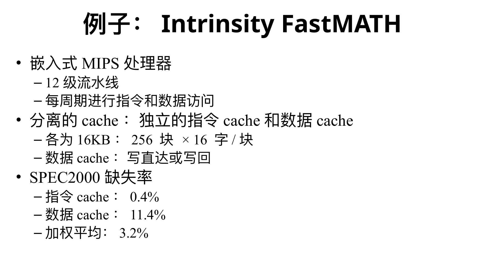

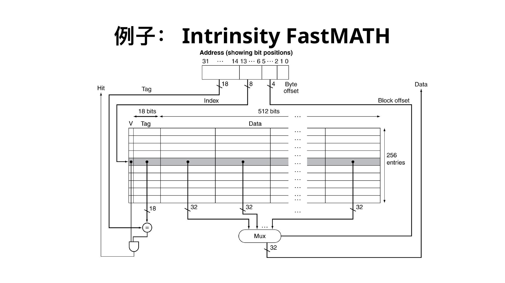

### 组相联版本

如果同样 4 KiB、块大小 16 B，但 4 路组相联：

总块数 = 4096 / 16 = 256 组数 = 256 / 4 = 64 = 2^6 offset = 4 位 index = 6 位 tag = 32 - 6 - 4 = 22 位

结论：相联度越高，组数越少，index 位越少，tag 位越多。

### 访问一个地址

假设直接映射，地址：

0x0000_1234

offset 是低 4 位：

offset = 0x4

index 是再往上的 8 位：

0x1234 \>\> 4 = 0x123 index = 0x23

tag 是剩下高位：

tag = 0x00001

访问流程：

1.  用 index `0x23` 找到 Cache 中那一行。

2.  看 valid 是否为 1。

3.  比较 tag 是否等于 `0x00001`。

4.  若匹配，用 offset `0x4` 取块内对应字节。

5.  若不匹配，发生 miss，把内存块调入这一行，并更新 tag 和 valid。

### 命中率题怎么做

地址序列：

0, 4, 8, 12, 16, 0

块大小 16 B，直接映射 Cache 足够大。块划分：

地址 0,4,8,12 属于块 0 地址 16 属于块 1

从空 Cache 开始：

0 : miss，调入块 0 4 : hit 8 : hit 12 : hit 16 : miss，调入块 1 0 : hit，块 0 仍在

命中 4 次，缺失 2 次，命中率 `4/6`，缺失率 `2/6`。

如果 Cache 只有 1 块，访问 16 会替换块 0，最后访问 0 又 miss。题目一定要看 Cache 容量和映射方式。

## 8.11 AMAT 和多级 Cache 完整演练

题目：

- L1 命中时间 1 cycle。

- L1 缺失率 5%。

- L2 命中时间 10 cycles。

- L2 缺失率 20%。

- 主存代价 100 cycles。

多级 AMAT：

``` math
AMAT = L1HitTime + L1MissRate \times (L2HitTime + L2MissRate \times MemoryPenalty)
```

代入：

AMAT = 1 + 0.05 × (10 + 0.20 × 100) = 1 + 0.05 × (10 + 20) = 1 + 1.5 = 2.5 cycles

注意这里的 L2 缺失率通常指“局部缺失率”：在已经 L1 miss 的访问中，有多少又 L2 miss。

如果题目给全局 L2 缺失率，要小心不要重复乘 L1 miss rate。读题时看它写的是：

- local miss rate：局部缺失率。

- global miss rate：全局缺失率。

## 8.12 虚拟存储从地址翻译开始理解

虚拟存储的核心是“程序看到的是虚拟地址，硬件最终要访问物理地址”。

虚拟地址：

\| VPN \| page offset \|

物理地址：

\| PPN \| page offset \|

页内偏移不变，因为虚拟页和物理页大小一样。需要翻译的是页号：

VPN -\> PPN

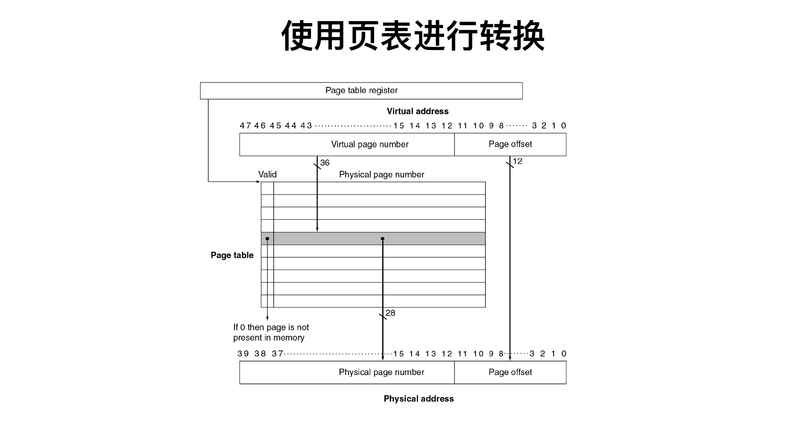

### 例题：页大小 4 KiB

页大小 4 KiB：

4 KiB = 4096 B = 2^12 B page offset = 12 位

32 位虚拟地址中：

VPN = 高 20 位 offset = 低 12 位

若虚拟地址是：

0x12345ABC

则：

VPN = 0x12345 offset = 0xABC

查页表发现：

VPN 0x12345 -\> PPN 0x00F00

则物理地址：

0x00F00ABC

### TLB 为什么必要

如果每次访存都先查页表，那么一次 load 可能变成：

访问页表 + 访问真正数据

访存次数翻倍。TLB 就是页表项的 Cache。

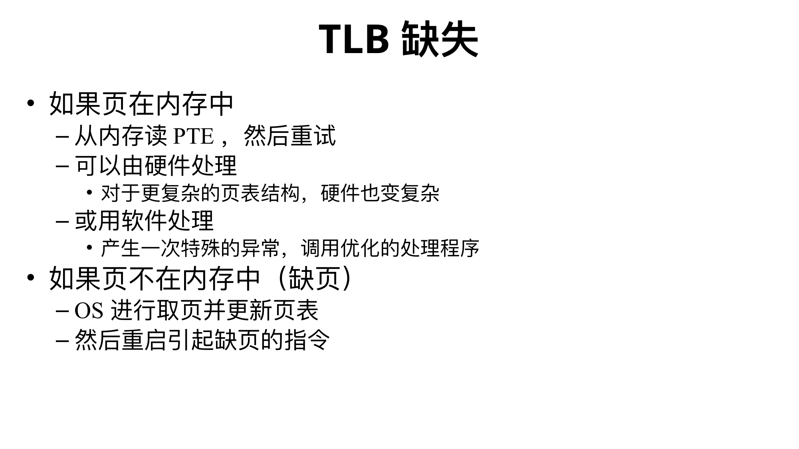

TLB 命中：

虚拟地址 -\> TLB 找到 PPN -\> 拼接 offset -\> 物理地址 -\> Cache/内存

TLB 缺失但页在内存：

查页表 -\> 把页表项装入 TLB -\> 重新翻译

页表项无效：

缺页异常 -\> 操作系统从磁盘调页 -\> 更新页表 -\> 重新执行指令

易错点：

- TLB miss 不等于 page fault。TLB miss 只是 TLB 里没有页表项；page fault 是页表项说这个页不在内存。

- Cache miss 不等于 page fault。Cache miss 通常从下一级存储器取块；page fault 可能要访问磁盘，代价大得多。

## 8.13 Cache 一致性用一个故事理解

假设两个 CPU 核都有自己的 Cache，内存中 `X = 0`。

第一步：

CPU A 读 X，把 X=0 放入 A 的 Cache CPU B 读 X，把 X=0 放入 B 的 Cache

第二步：

CPU A 写 X=1

如果没有一致性协议，CPU B 的 Cache 里还留着旧值 `X=0`。接下来 CPU B 读 X，会读到 0，这就错了。

无效化协议的做法：

CPU A 写 X 前，广播“我要写 X” CPU B 监听到后，把自己 Cache 里的 X 标记为 invalid CPU A 写 X=1 CPU B 下次读 X 时 miss，再去拿新值

一致性通常要求：

- 同一个处理器自己的读写顺序要合理。

- 一个处理器写入某地址后，其他处理器最终能看到。

- 对同一地址的写，所有处理器看到的顺序一致。

简答题答法：

问题：多核私有 Cache 可能保存同一内存块的多个副本。 后果：一个核心写入后，其他核心可能读到旧值。 硬件方案：监听式协议或目录协议；常用无效化或更新策略。 状态机制：用有效位、脏位以及 MESI 类状态记录块是否独占、共享、修改。 软件配合：锁、原子操作、内存屏障保证同步语义。

## 8.14 哈佛结构题怎样答得完整

题目通常问“哈佛结构和冯诺依曼结构相比有什么优缺点，现代处理器如何结合”。

先定义：

冯诺依曼结构：指令和数据放在同一个存储器/地址空间中。 哈佛结构：指令存储和数据存储分开。

再比较：

<table>
<thead>
<tr>
<th style="text-align: left;"><p>结构</p>
</th>
<th style="text-align: left;"><p>优点</p>
</th>
<th style="text-align: left;"><p>缺点</p>
</th>
</tr>
</thead>
<tbody>
<tr>
<td style="text-align: left;">冯诺依曼</td>
<td style="text-align: left;">统一地址空间，程序和数据都能用同一套机制处理，灵活，成本低</td>
<td style="text-align: left;">取指和访存争用通路，可能形成瓶颈</td>
</tr>
<tr>
<td style="text-align: left;">哈佛</td>
<td style="text-align: left;">取指和数据访问可并行，带宽更高，适合流水线</td>
<td style="text-align: left;">指令/数据空间分开，容量不易动态共享，系统复杂</td>
</tr>
</tbody>
</table>

现代折中：

L1 I-Cache 和 L1 D-Cache 分开，像哈佛结构。 L2/L3 Cache 和主存统一，像冯诺依曼结构。

这样做的原因：

- 流水线每周期都要取指，同时 load/store 也要访存。分离 I-Cache/D-Cache 可减少结构冒险。

- 更低层统一可简化内存管理，并允许代码和数据共享同一主存空间。

如果题目还问多核 Cache 问题，就接一致性：

多核中每个核心可能有私有 L1 Cache，同一数据块存在多个副本。 写入会造成副本不一致，需要 Cache coherence 协议。

## 8.15 并行处理题从 Amdahl 到 Roofline

### Amdahl 完整例题

题目：程序 90% 可并行，使用 8 个处理器，理想并行部分加速 8 倍。总加速比是多少？

``` math
Speedup=\frac{1}{(1-0.9)+0.9/8}
```

计算：

= 1 / (0.1 + 0.1125) = 1 / 0.2125 = 4.706

所以不是 8 倍。原因是 10% 串行部分完全没有加速。

若处理器无限多：

``` math
Speedup_{max}=\frac{1}{0.1}=10
```

这说明串行部分决定上限。

### Roofline 完整例题

题目：

- 峰值计算能力 100 GFLOP/s。

- 内存带宽 20 GB/s。

- 某程序算术强度 2 FLOP/Byte。

可达到性能：

``` math
\min(100,\ 20 \times 2)=\min(100,\ 40)=40\ GFLOP/s
```

因为 40 小于峰值计算 100，所以它是内存带宽受限。

若算术强度提高到 8 FLOP/Byte：

``` math
\min(100,\ 20 \times 8)=\min(100,\ 160)=100\ GFLOP/s
```

此时受计算峰值限制。

优化方向：

- 内存受限：提高局部性、分块、减少访存、合并访存。

- 计算受限：向量化、提高并行度、使用更快计算单元。

## 8.16 一套综合题从头做到尾

题目：

addi x5,x0,10 addi x6,x0,20 add x7,x5,x6 lw x8,0(x7) sw x8,4(x7)

已知单周期处理器，频率 1 GHz。问：

1.  程序执行完 `x5,x6,x7` 是多少。

2.  `add x7,x5,x6` 的 ALU 输入、ALU 操作、写回寄存器。

3.  若 `Mem``[``30``]``=99`，执行后 `x8` 和 `Mem``[``34``]` 是多少。

4.  程序理想执行时间。

逐条执行：

addi x5,x0,10 -\> x5 = 0 + 10 = 10 addi x6,x0,20 -\> x6 = 0 + 20 = 20 add x7,x5,x6 -\> x7 = 10 + 20 = 30 lw x8,0(x7) -\> x8 = Mem\[30\] sw x8,4(x7) -\> Mem\[34\] = x8

若 `Mem``[``30``]``=99`：

x8 = 99 Mem\[34\] = 99

第 2 问：

ALU 输入：x5 的值 10，x6 的值 20 ALU 操作：加法 写回寄存器：x7 写回值：30

第 4 问：

频率 1 GHz -\> 周期 1 ns 单周期 CPU 每条指令 1 周期 5 条指令 -\> 5 ns

如果换成流水线处理器，不考虑冒险，5 级流水线执行 5 条指令需要：

5 + 4 = 9 个周期

但这段代码有依赖：

addi x5 -\> add 使用 x5 addi x6 -\> add 使用 x6 add x7 -\> lw/sw 使用 x7 lw x8 -\> sw 使用 x8

如果有完整旁路，ALU 结果依赖可前递；`lw -> sw` 是否停顿取决于数据存储器写入数据的旁路设计。题目若没说明，不要擅自加复杂假设，按题目给定流水线规则判断。

# 9. 补充考点

本章补充容易出短问的概念。
## 9.1 SPEC、基准测试和性能陷阱

SPEC 是标准性能评测组织，常见基准包括：

- SPEC CPU：偏 CPU 计算性能，尽量减少 I/O、网络等因素影响。

- SPECpower：关注单位功耗下的性能，体现能耗比。

基准测试的意义：

- 用标准程序集合比较机器性能。

- 避免只用单个小程序造成片面结论。

- 区分响应时间和吞吐率。

常见陷阱/谬误：

- **只看时钟频率**：频率高但 CPI 或指令数更大，程序可能更慢。

- **只看 MIPS**：不同 ISA 的一条指令完成的工作不同，MIPS 不适合跨 ISA 比较。

- **只看峰值性能**：峰值是理想上限，真实程序受 Cache、分支、I/O、并行效率影响。

- **空闲功耗不重要**：服务器和移动设备大量时间可能处于低负载，空闲功耗会显著影响总能耗。

- **优化局部就等于整体快**：Amdahl 定律说明，被优化部分占比小，总收益也小。

看到“最可靠性能度量”，通常选执行时间；看到“能耗相关”，要想到功耗墙和性能/瓦。

## 9.2 同步、原子操作和 `lr/sc`

多处理器程序会出现数据竞争。例如两个线程同时执行：

x = x + 1;

这不是一个不可分割动作，实际包含：

读 x -\> 加 1 -\> 写 x

如果两个核心都读到旧值，再分别写回，就会丢失一次更新。

原子操作的目标：让“读-改-写”看起来不可分割。

RISC-V 可用 `lr/sc` 实现原子交换：

- `lr.d rd,(rs1)`：load-reserved，读取地址 `rs1` 的值，并对该地址建立保留。

- `sc.d rd,rs2,(rs1)`：store-conditional，若保留仍有效，就把 `rs2` 写入 `rs1` 指向的地址。

- `sc.d` 成功时通常返回 0，失败时返回非 0，失败需要重试。

典型自旋锁思路：

again: lr.d t0, (lock) \# 读锁 bne t0, x0, again \# 锁不是 0，说明有人占用 addi t1, x0, 1 sc.d t2, t1, (lock) \# 尝试写 1 bne t2, x0, again \# 写失败，重试

为什么需要 `lr/sc`：

- 普通 `lw/sw` 之间可能被其他核心插入写入。

- `lr/sc` 能检测这段时间内该地址是否被别人改过。

- 这为锁、信号量、原子计数器提供硬件基础。

简答题关键词：数据竞争、临界区、原子读改写、锁、内存一致性、同步开销。

## 9.3 多发射、动态调度和寄存器重命名

流水线每周期发射 1 条指令。多发射希望每周期发射多条指令，提高指令级并行 ILP。

静态多发射：

- 编译器决定哪些指令同一周期发射。

- 硬件较简单。

- 编译器必须避开结构、数据和控制冒险。

- 如果找不到可并行指令，发射槽会空着。

动态多发射：

- 硬件在运行时决定发射哪些指令。

- 可利用运行时信息，调度更灵活。

- 硬件复杂，功耗高。

动态调度的核心思想：

只要操作数准备好，即使前面的指令还没完成，也可以先执行后面的独立指令。

它需要处理三类相关：

- RAW：read after write，真数据相关，不能乱。

- WAR：write after read，名字相关，可通过寄存器重命名消除。

- WAW：write after write，名字相关，可通过寄存器重命名消除。

寄存器重命名：

- 架构寄存器数量固定，例如 `x1`。

- 硬件内部有更多物理寄存器。

- 不同指令写同一个架构寄存器时，可映射到不同物理寄存器，消除假相关。

推测执行：

- 分支结果未确定时，按预测路径先执行。

- 预测正确就提交结果。

- 预测错误就撤销推测路径。

为什么这部分常出概念题：

- 多发射和动态调度可以提升 ILP。

- 但依赖关系、分支、Cache miss、功耗和复杂性限制收益。

- 复杂性会带来功耗墙。

## 9.4 DRAM、Flash、磁盘、RAID 和 I/O

存储介质比较：

| 介质     |     速度 |        容量/成本 | 典型用途  | 关键特点           |
|:---------|---------:|-----------------:|:----------|:-------------------|
| SRAM     |     最快 |       贵、容量小 | Cache     | 不需刷新           |
| DRAM     |     较快 |       主存级容量 | 主存      | 需要刷新           |
| Flash    | 比磁盘快 | 介于 DRAM 和磁盘 | SSD、U 盘 | 擦写次数有限       |
| 磁盘 HDD |       慢 |     容量大、便宜 | 二级存储  | 机械寻道和旋转延迟 |

DRAM 为什么需要刷新：

- DRAM 用电容存储位。

- 电容会漏电。

- 必须周期性刷新，否则数据丢失。

磁盘访问时间：

磁盘访问时间 = 寻道时间 + 旋转延迟 + 传输时间 + 控制器开销

其中：

- 寻道时间：磁头移动到目标磁道。

- 旋转延迟：等待目标扇区转到磁头下。

- 传输时间：真正读写数据。

选择题常见判断：

- 顺序访问磁盘比随机访问快很多，因为寻道/旋转开销少。

- SSD 没有机械寻道，但仍有擦写粒度和寿命问题。

- Flash 写入前通常需要擦除，擦除块比读写页大。

RAID 的核心目标：

- 提高可靠性。

- 提高吞吐率。

- 用多个廉价磁盘组合出更好的存储系统。

常见 RAID：

- RAID 0：条带化，无冗余，性能高但可靠性差。

- RAID 1：镜像，可靠性高，容量利用率低。

- RAID 5：分布式奇偶校验，可容忍一个磁盘故障。

I/O 系统要点：

- 设备控制器负责和具体设备通信。

- 操作系统提供统一接口，隐藏设备差异。

- 中断让 CPU 不必一直轮询设备。

- DMA 可让设备直接和内存传输数据，减少 CPU 搬运负担。

## 9.5 汉明距离、ECC 和可靠性

汉明距离：两个码字对应位不同的个数。

例如：

101100 100110

不同位有 2 个，所以汉明距离为 2。

码字集合的最小汉明距离决定检错/纠错能力：

- 检测 `d` 位错误：最小距离至少 `d + 1`。

- 纠正 `d` 位错误：最小距离至少 `2d + 1`。

因此：

- 奇偶校验可以检测 1 位错误，但不能定位并纠正。

- SEC 需要能纠正 1 位错误，要求最小距离至少 3。

- SEC/DED 可纠正 1 位并检测 2 位错误，常用于 ECC DRAM。

可靠性指标：

``` math
Availability = \frac{MTTF}{MTTF + MTTR}
```

提高可用性有两个方向：

- 增大 MTTF：减少故障。

- 减小 MTTR：故障后更快修复。

## 9.6 虚拟机和虚拟机监视器

虚拟机 VM：让一个物理机器上运行多个隔离的系统环境。

虚拟机监视器 VMM/Hypervisor 的职责：

- 分配和隔离 CPU、内存、I/O 设备。

- 捕获敏感指令或特权操作。

- 管理客户机操作系统看到的虚拟硬件。

- 处理虚拟中断、虚拟 I/O、虚拟内存映射。

虚拟机和普通进程的区别：

- 普通进程共享同一个操作系统内核。

- 虚拟机通常运行自己的客户机操作系统。

虚拟机优点：

- 隔离性好。

- 便于服务器整合。

- 便于迁移、快照和恢复。

- 不同操作系统可运行在同一物理机上。

代价：

- VMM 带来额外开销。

- I/O 虚拟化复杂。

- 内存地址转换可能多一层，例如客户机虚拟地址到客户机物理地址，再到宿主机物理地址。

## 9.7 消息传递、互联网络和并行陷阱

共享内存并行：

- 多个处理器看到同一地址空间。

- 通过 load/store 共享数据。

- 需要锁、原子操作、Cache 一致性和内存一致性。

消息传递并行：

- 每个节点有独立地址空间。

- 节点之间通过 send/receive 通信。

- 常见于集群和分布式系统。

消息传递优点：

- 扩展性好。

- 每个节点相对独立。

- 不需要硬件维护全局 Cache 一致性。

消息传递缺点：

- 程序员需要显式划分数据和通信。

- 通信延迟和带宽成为瓶颈。

- 负载均衡困难。

互联网络常见指标：

- 延迟 latency：一条消息从源到目的的时间。

- 带宽 bandwidth：单位时间能传多少数据。

- 拓扑 topology：节点怎样连接。

- 二分带宽 bisection bandwidth：把网络切成两半时，跨切口可用带宽。

并行处理常见陷阱：

- 认为处理器数翻倍，性能就翻倍。实际受串行部分、通信和同步限制。

- 忽视负载均衡。最慢的线程会拖住整体。

- 忽视内存带宽。核心越多，访存压力越大。

- 忽视数据一致性。共享变量没有同步会出错。

- 把 GPU 当万能加速器。分支发散、随机访存、小规模任务都可能让 GPU 不划算。

## 9.8 常见陷阱和谬误

这些不是大计算题，但很适合出选择题：

- 执行时间通常比 MIPS/MFLOPS 更可靠。

- 性能不能只看频率。

- 指令数少不一定快，CPI 和时钟周期也重要。

- 流水线提高吞吐率，不缩短单条指令延迟。

- 旁路不能解决所有数据冒险，load-use 通常仍需阻塞。

- 分支预测错误需要清空错误路径指令。

- Cache 块越大不一定越好，太大会增加缺失代价和污染。

- 相联度越高不一定越好，可能增加命中时间和硬件复杂度。

- 平均访问时间必须把 miss penalty 算进去。

- TLB miss 不等于缺页。

- Cache coherence 不等于 memory consistency。

- 多核性能受通信、同步、串行部分和内存带宽限制。

- GPU 适合规则数据并行，不适合所有程序。
