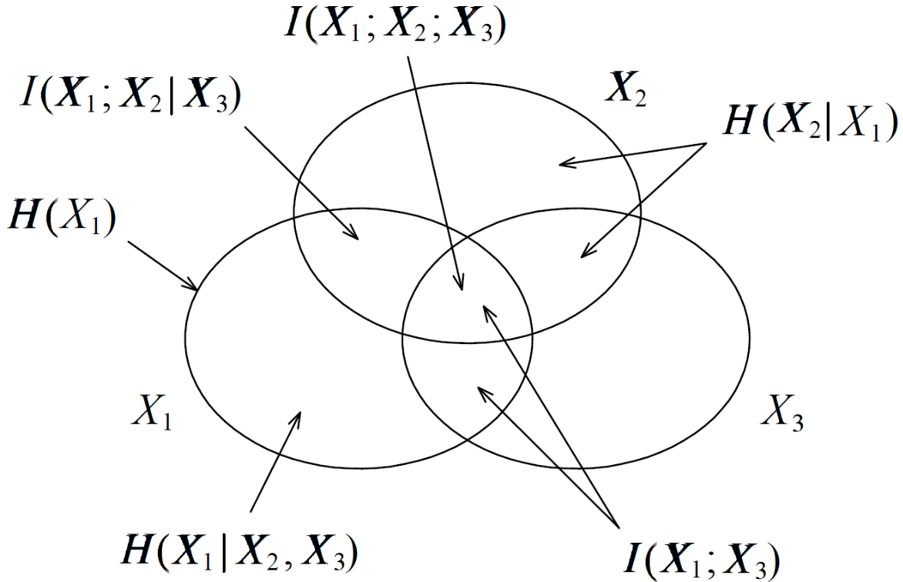
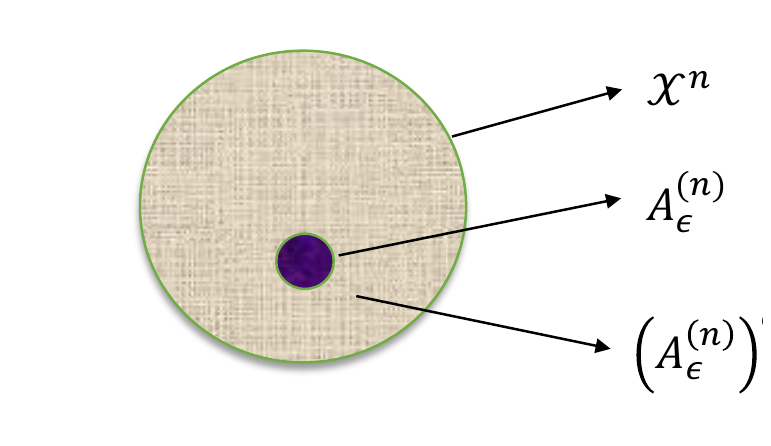
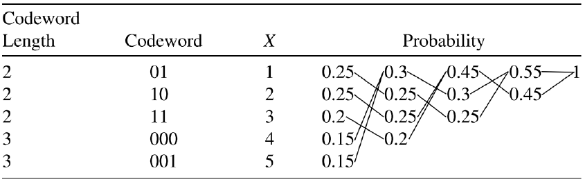
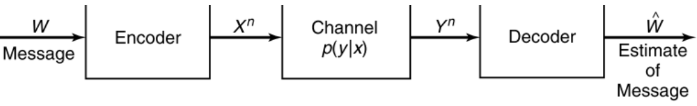
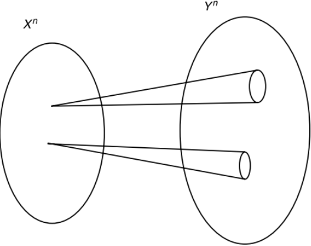
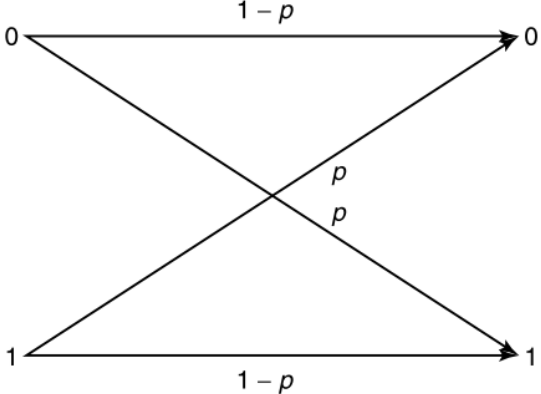
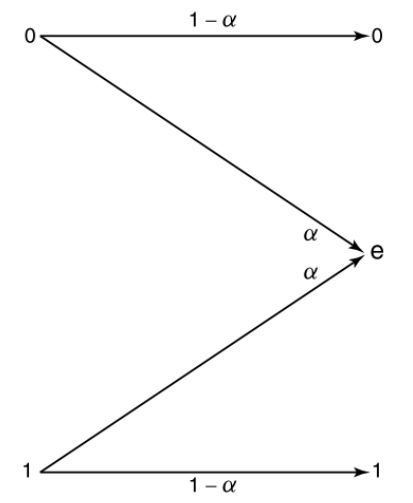
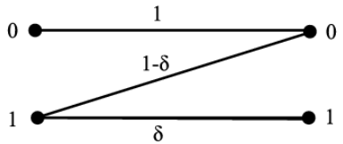

# 信息论复习笔记

约定：除非特别说明，$\log$ 以 2 为底，信息单位为 bit。

## 1. 信息度量

### 熵

自信息：

$$
\imath_X(x)=-\log p(x)=\log\frac1{p(x)}.
$$

离散熵：

$$
H(X)=-\sum_{x\in\mathcal X}p(x)\log p(x)
=\mathbb E\left[\log\frac1{p(X)}\right].
$$

性质：

- $0\le H(X)\le \log|\mathcal X|$。
- $H(X)=0$ 当且仅当 $X$ 几乎必然为常数。
- $H(X)=\log|\mathcal X|$ 当且仅当 $X$ 均匀。
- $H(p)$ 对分布 $p$ 是凹函数。

二元熵：

$$
h_2(p)=-p\log p-(1-p)\log(1-p).
$$

$h_2(p)=h_2(1-p)$，最大值 $1$ 在 $p=1/2$ 处取得。

### 联合熵与条件熵

$$
H(X,Y)=-\sum_{x,y}p(x,y)\log p(x,y).
$$

$$
H(Y\mid X)
=\sum_xp(x)H(Y\mid X=x)
=-\sum_{x,y}p(x,y)\log p(y\mid x).
$$

链式法则：

$$
H(X,Y)=H(X)+H(Y\mid X)=H(Y)+H(X\mid Y).
$$

多变量版本：

$$
H(X_1,\ldots,X_n)
=\sum_{i=1}^nH(X_i\mid X_1,\ldots,X_{i-1}).
$$

条件作用减少熵：

$$
H(X\mid Y,Z)\le H(X\mid Y)\le H(X).
$$

零条件熵：

$$
H(Y\mid X)=0
$$

当且仅当存在函数 $g$ 使 $Y=g(X)$ 几乎处处成立。

### KL 散度

$$
D(p\|q)=\sum_xp(x)\log\frac{p(x)}{q(x)}.
$$

性质：

- $D(p\|q)\ge0$，等号当且仅当 $p=q$。
- 一般 $D(p\|q)\ne D(q\|p)$，不是距离。
- 若 $p(x)>0,q(x)=0$，则 $D(p\|q)=\infty$。
- 对 $(p,q)$ 联合凸。

编码解释：

$$
\mathbb E_p[-\log q(X)] = H(p)+D(p\|q).
$$

用错分布 $q$ 编码真实分布 $p$，平均多付 $D(p\|q)$ bit。

### 互信息

定义：

$$
I(X;Y)=D(p_{XY}\|p_Xp_Y)
=\sum_{x,y}p(x,y)\log\frac{p(x,y)}{p(x)p(y)}.
$$

等价式必须熟：

$$
\boxed{
I(X;Y)
=H(X)-H(X\mid Y)
=H(Y)-H(Y\mid X)
=H(X)+H(Y)-H(X,Y)
}
$$

性质：

- $I(X;Y)=I(Y;X)\ge0$。
- $I(X;Y)=0$ 当且仅当 $X,Y$ 独立。
- $I(X;X)=H(X)$。
- $I(X;Y)\le \min\{H(X),H(Y)\}$。

条件互信息：

$$
I(X;Y\mid Z)=H(X\mid Z)-H(X\mid Y,Z)\ge0.
$$

注意：条件作用不一定减少互信息。若 $X,Y$ 独立且均为 $\mathrm{Bern}(1/2)$，令 $Z=X\oplus Y$，则

$$
I(X;Y)=0,\qquad I(X;Y\mid Z)=1.
$$

### 信息图



常用对应：

| 图形语言 | 信息论表达 |
|---|---|
| 并集 | $H(X,Y)$ |
| 交集 | $I(X;Y)$ |
| 差集 | $H(X\mid Y)$ |
| 三元交 | $I(X;Y;Z)=I(X;Y)-I(X;Y\mid Z)$ |

三元互信息可以为负，不要把它当普通面积。

## 2. 链式法则与不等式

熵链式：

$$
H(X^n)=\sum_{i=1}^nH(X_i\mid X^{i-1}).
$$

互信息链式：

$$
I(X^n;Y)
=\sum_{i=1}^nI(X_i;Y\mid X^{i-1}).
$$

KL 链式：

$$
D(p(x,y)\|q(x,y))
=D(p(x)\|q(x))
+D(p(y\mid x)\|q(y\mid x)).
$$

其中第二项表示对 $p(x)$ 加权平均：

$$
D(p(y\mid x)\|q(y\mid x))
=\sum_xp(x)\sum_yp(y\mid x)\log\frac{p(y\mid x)}{q(y\mid x)}.
$$

数据处理不等式：

$$
X\to Y\to Z
\quad\Longrightarrow\quad
I(X;Z)\le I(X;Y).
$$

等价直觉：处理数据不会凭空增加关于源的信息。

Fano 不等式。若 $X\to Y\to \hat X$，$P_e=\Pr(\hat X\ne X)$，则

$$
H(X\mid Y)\le H(X\mid \hat X)
\le h_2(P_e)+P_e\log(|\mathcal X|-1).
$$

常用弱化：

$$
H(X\mid Y)\le 1+P_e\log|\mathcal X|.
$$

反推错误率下界：

$$
P_e\ge \frac{H(X\mid Y)-1}{\log|\mathcal X|}.
$$

## 3. AEP、典型集与型

### AEP

若 $X_1,X_2,\ldots$ i.i.d. $\sim p(x)$，则

$$
-\frac1n\log p(X^n)\xrightarrow{P}H(X).
$$

弱典型集：

$$
A_\epsilon^{(n)}
=\left\{x^n:
\left|-\frac1n\log p(x^n)-H(X)\right|<\epsilon
\right\}.
$$

典型集三件事：

$$
\Pr(X^n\in A_\epsilon^{(n)})\to1.
$$

若 $x^n\in A_\epsilon^{(n)}$，

$$
2^{-n(H+\epsilon)}
\le p(x^n)
\le 2^{-n(H-\epsilon)}.
$$

典型集大小约为

$$
|A_\epsilon^{(n)}|\doteq 2^{nH(X)}.
$$



### 型

序列 $x^n$ 的型：

$$
P_{x^n}(a)=\frac1nN(a\mid x^n).
$$

类型数不超过

$$
(n+1)^{|\mathcal X|}.
$$

型类大小：

$$
\frac{1}{(n+1)^{|\mathcal X|}}2^{nH(P)}
\le |T(P)|\le
2^{nH(P)}.
$$

在分布 $Q$ 下，某个具体序列概率为

$$
Q^n(x^n)
=2^{-n[H(P_{x^n})+D(P_{x^n}\|Q)]}.
$$

类型类概率指数阶：

$$
Q^n(T(P))\doteq 2^{-nD(P\|Q)}.
$$

## 4. 熵率

随机过程 $\mathcal X=\{X_i\}$ 的熵率：

$$
\bar H(\mathcal X)
=\lim_{n\to\infty}\frac1nH(X_1,\ldots,X_n).
$$

条件熵率：

$$
H'(\mathcal X)
=\lim_{n\to\infty}H(X_n\mid X_1,\ldots,X_{n-1}).
$$

平稳过程满足：

$$
\boxed{\bar H(\mathcal X)=H'(\mathcal X)}.
$$

平稳马尔可夫链若平稳分布为 $\mu$、转移矩阵为 $P$：

$$
\bar H(\mathcal X)
=H(X_2\mid X_1)
=-\sum_i\mu_i\sum_jP_{ij}\log P_{ij}.
$$

二状态链

$$
P=
\begin{pmatrix}
1-\alpha & \alpha\\
\beta & 1-\beta
\end{pmatrix},
\qquad
\mu=\left(\frac{\beta}{\alpha+\beta},\frac{\alpha}{\alpha+\beta}\right),
$$

所以

$$
\bar H
=\frac{\beta}{\alpha+\beta}h_2(\alpha)
+\frac{\alpha}{\alpha+\beta}h_2(\beta).
$$

## 5. 信源编码

### 前缀码与 Kraft 不等式

$D$ 叉前缀码长度 $\ell_i$ 存在当且仅当

$$
\sum_iD^{-\ell_i}\le1.
$$

若长度满足 Kraft 不等式，就能构造前缀码。

最优平均长度：

$$
H_D(X)\le L^*<H_D(X)+1,
$$

其中

$$
H_D(X)=\sum_ip_i\log_D\frac1{p_i}.
$$

对 $n$ 个符号分组编码：

$$
\frac1nH(X^n)\le \frac1nL_n^*
<\frac1nH(X^n)+\frac1n.
$$

i.i.d. 情况下冗余小于 $1/n$，因此平均每符号码长可逼近 $H(X)$。

### Huffman 编码

Huffman 每次合并最小的两个概率。它给出单符号前缀码的最优平均长度。



步骤：

1. 概率从小到大排序。
2. 反复合并两个最小概率。
3. 从树根回标 0/1 得到码字。
4. 算 $L=\sum_ip_i\ell_i$，检查 $H(X)\le L<H(X)+1$。

### Shannon code 与错误分布

令

$$
\ell_i=\left\lceil\log\frac1{p_i}\right\rceil.
$$

则

$$
H(X)\le L<H(X)+1.
$$

如果真实分布是 $p$，但按 $q$ 设计码长：

$$
H(p)+D(p\|q)
\le \mathbb E_p\ell(X)
< H(p)+D(p\|q)+1.
$$

## 6. 信道容量

### DMC

离散无记忆信道由三元组

$$
(\mathcal X,p(y\mid x),\mathcal Y)
$$

给出，每次输出只依赖当前输入。



容量：

$$
\boxed{C=\max_{p(x)}I(X;Y)}.
$$

求容量的一般套路：

1. 写 $p(x)$，由转移矩阵算 $p(y)$。
2. 用

$$
I(X;Y)=H(Y)-H(Y\mid X).
$$

3. $H(Y\mid X)=\sum_xp(x)H(p(\cdot\mid x))$。
4. 对输入分布最大化。固定信道时 $I(X;Y)$ 关于 $p(x)$ 凹。

容量直觉：



### 常见信道

| 信道 | 容量 | 最优输入 |
|---|---:|---|
| 无噪二元信道 | $C=1$ | 均匀 |
| BSC$(p)$ | $C=1-h_2(p)$ | 均匀 |
| BEC$(\alpha)$ | $C=1-\alpha$ | 均匀 |
| Noisy typewriter | $C=\log 13$ | 均匀 |
| 弱对称信道 | $C=\log|\mathcal Y|-H(r)$ | 均匀 |
| Z channel 例题 | $C=\log(5/4)$ | $\Pr(X=1)=2/5$ |







BSC 推导：

$$
Y=X\oplus Z,\qquad Z\sim\mathrm{Bern}(p).
$$

$$
H(Y\mid X)=H(Z)=h_2(p),\qquad H(Y)\le1.
$$

均匀输入使 $Y$ 均匀，所以

$$
C=1-h_2(p).
$$

BEC 推导：

$$
H(Y\mid X)=h_2(\alpha),
$$

均匀输入时

$$
H(Y)=h_2(\alpha)+1-\alpha,
$$

所以

$$
C=1-\alpha.
$$

Z channel 例题若 $\Pr(X=1)=\pi$：

$$
I(X;Y)=h_2(\pi/2)-\pi.
$$

令导数为 0 得 $\pi^*=2/5$，容量

$$
C=\log(5/4).
$$

### 信道编码定理

信道码：

$$
M=2^{nR},\qquad R=\frac1n\log M.
$$

香农第二定理：

$$
R<C\Rightarrow \exists\ \text{codes with }P_e^{(n)}\to0,
$$

$$
R>C\Rightarrow P_e^{(n)}\not\to0.
$$

Achievability 证明骨架：

1. 随机生成 $2^{nR}$ 个码字。
2. 接收端找唯一与 $Y^n$ 联合典型的码字。
3. 真码字不联合典型的概率趋 0。
4. 错码字联合典型的概率约 $2^{-nI(X;Y)}$。
5. 并集界：

$$
P_e\lesssim \epsilon+2^{nR}2^{-n(I(X;Y)-3\epsilon)}.
$$

只要 $R<I(X;Y)-3\epsilon$，错误概率趋 0；再对 $p(x)$ 最大化得到 $R<C$。

Converse 证明骨架：

$$
nR=H(W)
=I(W;\hat W)+H(W\mid \hat W).
$$

由 Fano：

$$
H(W\mid \hat W)\le1+P_e^{(n)}nR.
$$

由数据处理：

$$
I(W;\hat W)\le I(X^n;Y^n).
$$

单字母化：

$$
I(X^n;Y^n)\le\sum_{i=1}^nI(X_i;Y_i)\le nC.
$$

合起来：

$$
nR\le nC+1+P_e^{(n)}nR.
$$

若 $P_e^{(n)}\to0$，则 $R\le C$。

反馈不增加 DMC 容量：

$$
C_{\mathrm{FB}}=C.
$$

信源-信道分离。若信源熵率为 $\bar H(\mathcal V)$，每个信源符号对应一次信道使用：

$$
\bar H(\mathcal V)<C
$$

时可可靠传输。若 $k$ 个信源符号使用 $n$ 次信道：

$$
\frac{k}{n}\bar H(\mathcal V)<C.
$$

## 7. 连续变量与高斯信道

### 微分熵

连续随机变量密度为 $f$：

$$
h(X)=-\int f(x)\log f(x)\,dx.
$$

微分熵可以为负，且缩放会改变：

$$
h(aX)=h(X)+\log|a|.
$$

离散量化关系：

$$
H(X^\Delta)+\log\Delta\to h(X),\qquad \Delta\to0.
$$

连续 KL 与互信息：

$$
D(f\|g)=\int f(x)\log\frac{f(x)}{g(x)}\,dx.
$$

$$
I(X;Y)=\iint f(x,y)\log\frac{f(x,y)}{f(x)f(y)}\,dxdy.
$$

互信息仍非负，且对可逆坐标变换不变。

高斯最大熵。若 $\operatorname{Var}(X)=\sigma^2$：

$$
h(X)\le \frac12\log(2\pi e\sigma^2),
$$

等号当且仅当 $X$ 高斯。

### AWGN 容量

信道：

$$
Y=X+Z,\qquad Z\sim\mathcal N(0,N),
$$

功率约束：

$$
\mathbb E[X^2]\le P.
$$

容量：

$$
\boxed{
C=\frac12\log\left(1+\frac PN\right)
}
$$

推导：

$$
I(X;Y)=h(Y)-h(Y\mid X)=h(Y)-h(Z).
$$

由于 $\operatorname{Var}(Y)\le P+N$，

$$
h(Y)\le\frac12\log(2\pi e(P+N)),
$$

而

$$
h(Z)=\frac12\log(2\pi eN).
$$

所以

$$
I(X;Y)\le\frac12\log\left(1+\frac PN\right).
$$

等号由 $X\sim\mathcal N(0,P)$ 达到。

### 并行高斯信道与水填充

若

$$
Y_j=X_j+Z_j,\qquad Z_j\sim\mathcal N(0,N_j),
$$

总功率 $\sum_jP_j\le P$，容量优化为

$$
C=\max_{P_j\ge0,\ \sum_jP_j\le P}
\sum_j\frac12\log\left(1+\frac{P_j}{N_j}\right).
$$

水填充解：

$$
P_j=[\nu-N_j]^+,
$$

$\nu$ 由

$$
\sum_j[\nu-N_j]^+=P
$$

确定。

## 8. 解题模板

### 算 $H,D,I$

1. 先从联合表算 $p_X,p_Y$。
2. 算 $H(X),H(Y),H(X,Y)$。
3. 用

$$
H(X\mid Y)=H(X,Y)-H(Y).
$$

4. 用

$$
I(X;Y)=H(X)+H(Y)-H(X,Y).
$$

5. 判断独立：看 $p(x,y)=p(x)p(y)$，或看 $I(X;Y)=0$。

### 证明不等式

常用开局：

- 把两边展开成熵。
- 移项后识别为 $I(\cdot;\cdot\mid\cdot)\ge0$。
- 或构造 KL 散度 $D(p\|q)\ge0$。
- 若出现处理链路，尝试用 DPI。

### 求 DMC 容量

1. 设输入参数，例如 $\Pr(X=1)=\pi$。
2. 由信道矩阵写输出分布。
3. 写

$$
I(X;Y)=H(Y)-H(Y\mid X).
$$

4. 对参数求导或利用对称性。
5. 检查边界点。

### 写信道编码证明

Achievability：

```text
随机码本 -> 联合典型译码 -> 两类错误 -> 并集界 -> R < I(X;Y) -> 最大化
```

Converse：

```text
均匀消息 -> Fano -> 数据处理 -> 单字母化 -> R <= C
```

### 常见坑

- $H(X\mid Y)\le H(X)$，但 $I(X;Y\mid Z)$ 不一定小于 $I(X;Y)$。
- $D(p\|q)$ 不对称，真实分布放前面。
- AEP 不是说所有序列等概率，而是高概率集中到约 $2^{nH}$ 个典型序列上。
- $H(X\mid Y)=0$ 的方向是“$Y$ 由 $X$ 决定”，不要反过来。
- 熵率不是单时刻熵；平稳马尔可夫链用 $H(X_2\mid X_1)$。
- 信道容量优化的是输入分布 $p(x)$，信道转移概率固定。
- 微分熵可为负，互信息仍非负。
- AWGN 里的 $P,N$ 是功率/方差，不是标准差。
- 水填充不是平均分功率，而是 $P_j=[\nu-N_j]^+$。

## 9. 公式速查

### 信息度量

$$
H(X)=-\sum_xp(x)\log p(x)
$$

$$
H(X,Y)=H(X)+H(Y\mid X)
$$

$$
D(p\|q)=\sum_xp(x)\log\frac{p(x)}{q(x)}
$$

$$
I(X;Y)=H(X)-H(X\mid Y)=D(p_{XY}\|p_Xp_Y)
$$

$$
X\to Y\to Z\Rightarrow I(X;Z)\le I(X;Y)
$$

$$
H(X\mid Y)\le h_2(P_e)+P_e\log(|\mathcal X|-1)
$$

### AEP 与编码

$$
-\frac1n\log p(X^n)\xrightarrow{P}H(X)
$$

$$
|A_\epsilon^{(n)}|\doteq2^{nH(X)}
$$

$$
\sum_iD^{-\ell_i}\le1
$$

$$
H_D(X)\le L^*<H_D(X)+1
$$

### 信道

$$
C=\max_{p(x)}I(X;Y)
$$

$$
C_{\mathrm{BSC}(p)}=1-h_2(p)
$$

$$
C_{\mathrm{BEC}(\alpha)}=1-\alpha
$$

$$
C_{\mathrm{weak\ sym}}=\log|\mathcal Y|-H(r)
$$

$$
C_{\mathrm{AWGN}}=\frac12\log\left(1+\frac PN\right)
$$
